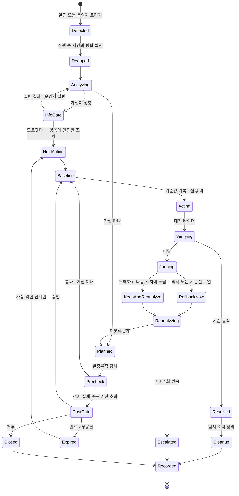
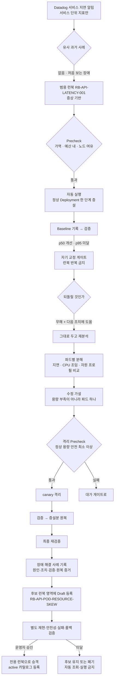
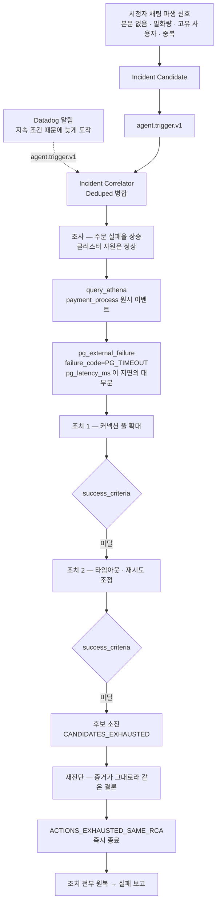

# 장애 시나리오 실험 — 복구 기준과 주입 설정

세 시나리오(채팅 총량 · 느린 파드 · 외부 결제 PG 장애)의 **흐름과, 재현 가능하게
돌리고 판정하기 위한 규칙**이다. 0절이 시나리오가 무엇인지, 1~3절이 어떻게
판정하고 무엇을 주입하는지다.

> 발표 구성·시연 순서·슬랙 메시지 문안은 저장소 밖 기획 문서에 있다.
> **여기에는 구현과 실험에 필요한 것만 둔다.**

> **수치는 여기에 확정하지 않는다.** 실측값은 전부 `docs/measurements.md` 가
> 원본이고 이 문서는 참조만 한다. 안 잰 값은 "안 쟀다" 로 남긴다 (`AGENTS.md`
> "숫자를 지어내지 않는다").

## 인덱스

| 절 | 무엇 |
|---|---|
| 0 | 시나리오 셋과 게이트 셋 — 정의, 공통 상태 머신, 시나리오별 흐름 |
| 1 | 복구 판정 — 규칙 둘, 시나리오별 기준 |
| 2 | 장애 주입 — 지켜야 할 것 넷, 시나리오별 설정 |
| 3 | 실행 사이 초기화 |
| 4 | 실행 Runbook — 주입·원복 명령과 입력값 안전장치 |

---

## 0. 시나리오 셋과 게이트 셋

### 0.1 세 갈래 — 상태 머신이 도달하는 종착역

시나리오 셋은 **상태 머신이 실제로 도달하는 세 종착 상태**에 일대일로 묶인다.
다른 끝은 없다.

| 경로 | 종착 | 사람이 나오나 | 시나리오 |
|---|---|---|---|
| **승인 → 해결** | `RESOLVED` | 실행 **전에** 승인 1회 | S1 |
| **재진단 → 해결** | `RESOLVED` | **안 나옴** | S2 |
| **소진 → 실패 보고** | `RETRY_LIMIT_EXCEEDED` | 다 해본 **뒤에** 인계 | S3 |

**사람을 부르는 지점은 Guardrail 하나뿐이다.** 카탈로그 등급을 조회해 결정론적으로 정한다 —
`L1`/`L2` 는 `AUTO`, `L3` 는 `APPROVAL`, 카탈로그에 없으면 `DENY`.
**"물어봐야 하나" 를 LLM 이 판단하지 않는다.** 다만 이것은 현재 승인 라우팅
규칙이고 L1/L2/L3 부여 척도와 KNOB precondition 집행은 아직 없다. 실제 상태는
`runbook-catalog.md`와 D-079를 본다.

| 버튼 | 그 다음 | 사람이 기여한 것 |
|---|---|---|
| 승인 | 조치 실행 → 검증 | 가치판단 |
| 다시 보기 | 그 조치가 `excluded_actions` 로. 코멘트가 다음 진단·계획 입력 | 정보 |
| 거부 | 재시도 없이 `ESCALATED` | 권한 회수 |

### 0.2 분류와 런북은 다른 축이다

| 축 | 값 | 기준 |
|---|---|---|
| 분류 | 알려진 장애 / 처음 보는 장애 | **과거에 같은 원인의 사례가 있는가** (S3 Vectors 유사도 임계) |
| 런북 | 전용(원인 기반) / 범용(증상 기반) / 없음 | 절차가 원인에 붙었나 증상에 붙었나 |

**런북을 썼다고 알려진 장애가 되는 것이 아니다.** 범용 런북은 원인을 몰라도 쓴다.
S2 가 그 경우다 — 처음 보는 장애인데 증상 기반 런북으로 시작한다.

#### 런북의 종류와 운영 상태도 다른 축이다

장애가 해결됐다고 그 해결 절차가 곧바로 전용 런북이 되지는 않는다.
**원인 확인**과 **절차 검증**은 별도 판정이다.

| 운영 상태 | 무엇을 담나 | Agent 조회·실행 |
|---|---|---|
| 해결 사례 | 이번 장애의 관측·가설·조치·검증·원복 결과 | 재분석 근거로만 사용. 실행 절차로 취급하지 않음 |
| 후보 런북 (`draft`) | 해결 사례에서 일반화한 적용 조건·조치·검증·롤백 초안 | 운영 런북 조회와 자동 실행에서 제외 |
| 전용 런북 (`active`) | 재현성·안전성·실패·롤백 검증과 사람 승인을 통과한 원인 기반 절차 | 조건이 맞을 때만 조회·실행 가능 |

후보 런북은 별도 영역에 둔다. 최소한 다음을 통과한 뒤에만 전용 런북으로
승격한다.

1. 같은 원인으로 장애를 반복 재현하고, 같은 조치로 복구되는가
2. 진입 조건과 제외 조건이 관측 가능한 지표로 판정되는가
3. 정상 상태에 잘못 적용했을 때의 부작용과 최대 영향 범위를 확인했는가
4. 성공·실패·중단 기준과 안정화 대기 시간이 고정돼 있는가
5. 원복 절차가 실제로 동작하고 원복 후 기준선이 회복되는가
6. 소유자·버전·검증 증거·검토일을 남기고 운영자가 승인했는가

한 번의 복구는 **후보를 만들 근거**이지, 자동 실행 가능한 전용 런북의 증거가 아니다.
승격 전 같은 원인의 장애가 재발하면, 원인 사례의 사람 검증 여부에 따라
`알려진 장애`로 분류될 수는 있어도 **검증된 전용 런북은 없는 상태**다. 후보 절차를
자동 실행하지 않고 범용 런북 또는 분석에서 시작한다.

#### 범용 런북 등록 기준

범용 런북은 단순히 "자주 하는 조치"가 아니다. 원인을 모르는 상태에서도
안전하게 실행하면서 가설을 좁힐 수 있어야 한다.

| 기준 | 필수 내용 |
|---|---|
| 선택 가능성 | 원인이 아니라 관측 가능한 증상·진입 임계값으로 선택할 수 있음 |
| 제한된 조치 | 가역적이며 대상·최대 변경량·유지 시간·비용 예산이 고정됨 |
| 사전 검사 | 적용 금지 조건·용량 여유·장애 격리 범위를 결정론적으로 확인함 |
| 검증 가능성 | 실행 전 Baseline과 성공·실패·즉시 중단 지표가 미리 정해져 있음 |
| 반복 방지 | 같은 인시던트에서 최대 실행 횟수가 1회이며 실패 후 같은 조치를 반복하지 않음 |
| 원복 가능성 | 원복 방법과 원복 후 재검증 기준이 실제로 검증돼 있음 |
| 운영 책임 | 소유자·버전·검토일·만료일·변경 이력이 있음 |

하나라도 빠지면 범용 런북이 아니라 **분석 중 참고 절차**다. 자동 실행 대상으로
등록하지 않는다. S2의 `RB-API-LATENCY-001`도 이 기준을 충족했다는 검증 증거가
있어야 범용 런북으로 사용할 수 있다.

### 0.3 시나리오 셋

| # | 진입 | `rca_category` | 장애 | 조치 | 종착 |
|---|---|---|---|---|---|
| **S1** | Datadog | `chat_channel_overload` | 채팅 총량이 채널 감당 선 초과 → 전파 지연 | 채널 총량 제한 (`L3`) | **승인 → 해결** |
| **S2** | Datadog | `pod_resource_exhaustion`<br>→ `pod_load_skew` | Service 에 붙은 파드 하나만 CPU 조임 → 서비스 꼬리 지연 | 증설 → 미달 → 격리 (둘 다 `L1`/`L2`) | **재진단 → 해결** |
| **S3** | **채팅** | `pg_external_failure` | 외부 결제 PG 지연 → 주문 타임아웃 | 커넥션 풀 · 타임아웃 조정 (전부 증상 완화) | **소진 → 실패 보고** |

**인시던트 단위가 셋 다 다르다.** 이것이 곧 `Deduped` 병합 키다.

| | 단위 | 근거 |
|---|---|---|
| S1 | `service` + **`broadcast_id`** | 채널 총량은 방송마다 별개다. 다른 방송의 폭주는 다른 인시던트이고 조치도 그 방송에만 건다 |
| S2 | `service` + **`deployment`** | 파드가 여럿 이상해도 원인이 하나의 Deployment 설정이면 한 인시던트다 |
| S3 | **`service` 만** (방송 무관) | 외부 의존이라 모든 방송에 동시에 영향한다. **`broadcast_id` 를 병합 키에서 뺀다** — 안 그러면 같은 사건이 방송 수만큼 늘어난다 |

### 0.4 공통 상태 머신

세 시나리오가 모두 이 위에서 돈다. 시나리오별 차이는 **어느 분기를 타는가**뿐이다.



지켜야 하는 것 넷.

| 상태 | 불변조건 |
|---|---|
| `Deduped` | 진입점이 둘이라 **같은 장애가 두 번 들어온다.** D-055의 결정론적 조건으로 같은 진행 중 사건에 붙이고, 모호하면 강제 병합하지 않는다 |
| `Baseline` | 기준값 기록 · 실행 락 · 멱등 키. **이것 없이 `Acting` 으로 가지 않는다** |
| `Verifying` | `verification_metrics` 로만 판정. **런북으로 시작했으면 그 런북이 지정한 지표로** |
| 런북 반복 금지 | 런북 조치가 검증 실패하면 **같은 절차를 다시 실행하지 않는다** |

`Judging` 의 세 갈래는 `diagnostic_contamination` 을 조회해 정한다.
**무조건 되돌리는 것이 규칙이 아니다** — 틀린 조치와 불완전한 조치는 다르다.

### 0.5 S1 흐름 — 승인 → 해결


**첫 파동은 어떤 조치로도 못 막는다** — 알림→분석→승인→적용 사이에 단발 스파이크는
끝나 있다. 조치가 낮추는 것은 **지속 고원**이다. 그래서 검증도 적용 시각 이후만 센다.

### 0.6 S2 흐름 — 재진단 → 해결 (사람 없음)



**재분석은 1회다.** 초과하면 `Escalated` 로 사람에게 넘긴다.
**최종 재검증까지가 조치의 끝이다** — 2.2 참조.
그 뒤의 후보 런북 검증과 승격은 인시던트 처리와 분리된 사후 절차다.
따라서 S2 시연에서 확정할 수 있는 것은 **복구와 후보 런북 등록까지**이며,
전용 런북의 활성화만 별도 검증 완료 후에 가능하다. 다음 재발의 `알려진 장애`
분류는 전용 런북 유무가 아니라 과거 원인 사례의 사람 검증 결과로 독립 판정한다.

### 0.7 S3 흐름 — 소진 → 실패 보고 (채팅 진입)



**이 시나리오는 해결되지 않는 것이 정답이다.** 원인은 정확히 진단하지만
**고칠 수단이 카탈로그에 없다** — 남은 조치가 전부 증상 완화이고 PG 자체를 빠르게 만들지 못한다.

`ACTIONS_EXHAUSTED_SAME_RCA` 는 단순 카운터가 아니다. **증거가 안 바뀌었는데 결론이 바뀌면
그게 더 이상하므로**, 재진단이 같은 `rca_category` 를 내면 남은 재시도를 태우지 않고 즉시 끝낸다.

**주입은 목업 PG 스텁 하나다. 결제 인프라를 만들지 않는다.**
배선은 이미 있고 호출하는 코드만 없다 — SDK 에 `payment_process` 이벤트와
`pg_latency_ms` · `failure_code`(`PG_TIMEOUT` 등)가 정의돼 있고, warm 은 `pg_latency_ratio` 를
이미 집계하며, `pg_external_failure` 는 진단 enum 과 복구 판정 폴백에 이미 있다.

```python
# apps/api/app/services/payment.py — 목업 PG
delay_ms  = int(valkey.get("cfg:pg:delay_ms")  or 0)
fail_rate = float(valkey.get("cfg:pg:fail_rate") or 0)
time.sleep(delay_ms / 1000)
# 같은 Idempotency-Key는 같은 표본을 써 재시도 결과가 뒤집히지 않는다.
failed = deterministic_sample(idempotency_key) < fail_rate
emit.payment_process(..., result="FAILED" if failed else "SUCCESS",
                     failure_code="PG_TIMEOUT" if failed else None,
                     failure_stage="PG_CALL" if failed else None,
                     pg_latency_ms=pg_ms, total_latency_ms=pg_ms)
```

| | |
|---|---|
| 주입 · 해제 | `SET cfg:pg:delay_ms` · `cfg:pg:fail_rate` / 해제는 `DEL`. 재배포 없이 켜고 끈다 |
| **어디에 넣나** | **`order-worker` 가 아니라 `api` 주문 접수 경로.** worker 에 넣으면 SQS 백로그가 쌓여 `queue_backlog` 로 오진한다 — 이 시나리오는 "정확히 진단했는데 못 고친다" 가 핵심이라 오진이 방해된다 |
| 세기 | 동기 라우트라 uvicorn 스레드풀이 마르고 api p95 가 전면 상승한다(알림이 뜨니 좋다). 너무 세면 api 가 죽어 `pod_resource_exhaustion` 처럼 보인다 — **주문은 깨지는데 읽기는 사는 구간**을 찾는다 |
| 런북 | **조치 후보가 최소 둘** 있어야 `rr` 이 올라 "다 해봤다" 가 성립한다 |

**채팅 본문을 Agent 에게 주지 않는다.** 시청자가 자유롭게 타이핑하는 유일한 입력이라
본문을 저장하면 프롬프트 인젝션 경로가 된다. 파생값만 쓴다.

| 무엇 | 어디 |
|---|---|
| 본문을 싣지 않는 근거 | `contracts.md` 5.3 "본문은 싣지 않는다" (설계 8.5 프롬프트 인젝션) |
| 파생 신호 스키마 | `contracts.md` 5.6 `chat.signal.v1` |
| Candidate 스키마 | `contracts.md` 5.7 `chat.incident_candidate.v1` |
| Candidate 생성·Incident 호출 정책 | `docs/chat-incident-candidate.md`, `docs/agent-entrypoint.md` 1.2, D-055 |

**Chat trigger 생성은 `CANDIDATE_CREATED`에서 한 번만이다**(D-050, D-055).
쿨다운 중 `CANDIDATE_UPDATED`는 저장만 한다.

**진입점이 둘이 되면 Agent 호출 전에 병합 계층이 반드시 필요해진다**(0.4 `Deduped`, D-055).
채팅으로 하나, 알림으로 하나 들어오므로 합치지 않으면 같은 사건을 두 번 조사한다.
**S3 는 병합 키에서 `broadcast_id` 를 뺀다**(0.3) — 외부 의존이라 모든 방송에 동시에 영향하기 때문이다.

---

## 1. 복구 판정

### 1.1 규칙 둘

**① 계약 SLO 복귀 _AND_ 조치 직전 기준선 대비 개선, 둘 다 만족해야 한다.**

- SLO 만 보면 **부하가 저절로 빠져도 통과**한다. 자연 회복이 조치 효과로 기록된다.
- 기준선 개선만 보면 **여전히 계약 위반인데 "해결"** 이 된다.

`Baseline` 상태가 조치 직전 값을 찍는 이유가 이것이다.

**② 빨라졌나 + 안 망가뜨렸나, 둘 다 본다.**

지연만 보면 **"정상 사용자 절반을 차단해서 빨라진 것"** 이 성공이 된다.
그래서 **정상 사용자 차단률**을 항상 같이 판정한다.

> 검증 대기는 **60초 이상**. warm path 집계 창이 10초라 그보다 짧으면
> 창 하나가 튄 것으로 판정이 뒤집힌다.

### 1.2 시나리오별

| | 성공 | 놓치면 안 되는 것 |
|---|---|---|
| **S1** | 전파 p95 가 붕괴 전 구간으로 복귀 **AND** 정상 사용자 차단률이 상한 이내 | **효과는 조치 적용 시각 이후만 센다.** 첫 파동은 이미 지나가 있다.<br>채팅 전파 계약 기준이 저장소에 없다 — M-010 실측 형상을 기준선으로 쓴다 |
| **S2** | 격리 후 p95 가 **canary 붙이기 전** 값으로 복귀 | **증설분을 원복한 뒤에도 유지되어야 끝이다.** 남긴 채 회복하면 "결국 파드를 늘려서 나은 것" 을 배제할 수 없다.<br>1차 증설은 **실패해야 정상**이다 — p50 만 개선되고 p95 는 그대로 |
| **S3** | **"해결" 이 성공 기준이 아니다.** ① 한도까지 시도 ② 같은 조치 반복 없음 ③ **한도에서 멈춤** ④ 보고에 원인·시도·필요한 것이 다 있음 ⑤ 조치 전부 원복 | 유일하게 **실패로 끝나는 것이 정답**인 시나리오다. 해결 안 됐는데 `RESOLVED` 로 닫히면 실패이고, **한도를 넘겨 계속 시도해도 실패**다.<br>재진단이 같은 결론을 내는 것은 버그가 아니다 — 증거가 안 바뀌었으니 정직한 결과다 |

---

## 2. 장애 주입

### 2.1 지켜야 할 것 넷

| | |
|---|---|
| **부하 아니면 설정, 둘 중 하나로만** | 프로세스를 죽이거나 네트워크를 끊지 않는다. S1·S3 는 부하, S2 는 설정. FIS·Chaos Mesh 불필요 |
| **k6 에 식별용 표식을 붙이지 않는다** | 봉투에 실려(T-023) warm path 를 거쳐 **Agent 가 읽는 지표**가 된다. 표식은 곧 정답 라벨이다. S3 는 `ua_diversity` 가 판별 신호라 특히 치명적이다. `read-path.js` 에 지금 커스텀 헤더가 없다 — **넣지 않는다** |
| **콜드 캐시에서 시작하되 `stock:*` 은 지우지 않는다** | 재고는 Valkey 가 원본이다(D-07). 지우면 재고가 0 으로 표시되고 다음 주문 측정까지 망가진다. 비우려면 `kubectl rollout restart deploy/api` |
| **측정할 땐 모니터 Downtime, 주입할 땐 해제** | 안 재우면 측정 중에 Agent 가 깨어나 무언가 바꾼다 |

### 2.2 시나리오별

| | 무엇을 주입하나 | 안 하면 실패하는 것 |
|---|---|---|
| **S1** | `broadcast.js` 로 `아이템/s = 시청자 × 발화율` 을 M-010 붕괴점 위로. **연결 축**으로 올린다 — 같은 총량이면 연결이 많을수록 확실히 무너진다(M-010 해석 2) | **발화자를 넓게 퍼뜨린다.** 기존 조건(`발화자 수 = 채팅율 × 6`)은 발화자가 좁아 **1인 도배로 보인다.** 전제는 *전원이 한도 안인데 인원이 많아 총량이 넘는다* 이므로, 발화자를 늘리고 1인당 발화율을 낮춰 **전원이 `CHAT_RATE_PER_MIN` 아래**가 되게 한다.<br>파형은 **첫 파동 + 지속 고원** — 지금은 고정 발화율이라 추가해야 한다 |
| **S2** | canary Deployment 를 같은 Service 에 붙인다. main 과 **같은 이미지·같은 셀렉터, CPU 상한만** 낮게. 부하는 `read-path.js` 고정 도착률 | **CPU 상한 값 잡기** — 총 부하를 총 포화 아래로 두고, `파드당 RPS × M-009 기울기` 로 필요 CPU 를 구한 뒤 그보다 낮은 구간을 스윕해 **Ready 는 유지되면서 파드별 p95 가 이상치로 뜨는 값**을 고른다.<br>너무 낮으면 파드가 Service 에서 빠져 저절로 회복된다 — **canary 에만** `readinessProbe` 의 `timeoutSeconds`·`failureThreshold` 를 올려 창을 넓힌다 |
| **S3** | **목업 PG 스텁**에 `cfg:pg:delay_ms` · `cfg:pg:fail_rate` 를 SET 하고 k6 주문 부하를 건다. `payment_process` 이벤트가 `pg_latency_ms` · `failure_code=PG_TIMEOUT` 을 싣고 나간다 | **지연을 끝까지 유지한다** — 중간에 풀리면 자연 회복이 조치 효과로 기록되고 `RESOLVED` 로 잘못 닫힌다.<br>**`api` 주문 접수 경로에 넣는다** — `order-worker` 에 넣으면 SQS 백로그가 쌓여 `queue_backlog` 로 오진한다.<br>**런북에 조치 후보 최소 둘** — 하나면 `rr` 이 안 올라 "다 해봤다" 가 성립하지 않는다 |

**파드별 지연 지표는 이미 있다.** `p95:o2.apm.request.duration{...} by {pod_name}` 을
`monitor.tf` 의 `latency_p95_pod_outlier` 가 DBSCAN 으로 본다.
**조임 비율(`cfs.*`)은 보지 않는다** — 이 클러스터는 CPU limit 을 일부러 안 걸어서
그 지표가 **영구히 비어 있다**(D-064). 파드별 CPU 는 `kubernetes.cpu.usage.total by {pod_name}`
사용량으로 보되, **조여진 파드는 상한에 막혀 오히려 낮게 나온다**는 점을 기억한다.
**ALB 액세스 로그는 쓰지 않는다** — 전달 지연이 커서 실험 반복에 안 맞는다.

> **은폐와 범위는 다르다.** canary 설정값은 채점자 전용이지만 Agent 는 재분석에서
> `kubectl` 로 조회할 수 있어야 한다. **첫 알림 문맥에만 안 들어가면 된다.**

---

## 3. 실행 사이 초기화

| | |
|---|---|
| 노브 · 카운터 | `cfg:*` 삭제 · `chat:rate:*` · 채널 총량 카운터 |
| 파드 수 | main replicas 복원 · canary 제거 |
| 캐시 | Valkey 는 **메타 키만** — `stock:*` 금지 (2.1) |
| 시나리오 간섭 | S3 전 **canary 제거** 확인 · S2 전 **`cfg:pg:*` 해제** 확인. 지연이 남아 있으면 S2 의 p95 판정이 오염된다 |
| **Datadog 모니터 상태** | **OK 로 돌아왔는지 확인하고 다음 실행을 시작한다.** ALERT 로 남아 있으면 다음 실행에서 알림이 다시 안 떠서 Agent 가 안 깨어난다 — **반복 실행에서 가장 자주 밟는다** |
| k6 | 누락 반복 수 0 인지 확인. 아니면 부하 생성기가 먼저 막힌 것이다 |
| 노드 | 부하 뒤 Karpenter 임시 노드가 남았는지 본다(D-051) |

### 파드 수를 조치 수단으로 쓸 때

Argo 는 `selfHeal` 이 켜져 있어(`04-platform/argocd.tf`) 매니페스트와 다르면 되돌린다.
넘기는 방법이 둘인데 **경우에 따라 다르다.**

| 경우 | 방법 | 왜 |
|---|---|---|
| 파드 수를 **다른 컨트롤러가 상시 소유**한다 | 매니페스트에서 `replicas` 를 **뺀다** | `order-worker` 가 이렇게 한다 — KEDA 가 소유하므로 선언할 기준값이 없다 |
| 파드 수를 **평소엔 선언해두고 실험 중에만 바꾼다** | `replicas` 를 적고 Argo 의 **`ignoreDifferences`** 로 그 필드만 제외한다 | S2 의 api 가 이 경우다. **정상 파드 수가 기준값이라 git 에 남아야** 하고, 조치는 그 위에서 일시적으로 움직인다 |

`ignoreDifferences` 는 Argo 가 **되돌려주지도 않는다**는 뜻이므로,
실험 종료 시 **복원은 초기화 절차가 책임진다**(위 표의 "파드 수" 행).

대상에 **HPA·KEDA 를 붙이지 않는다** — 되돌리는 주체가 하나 더 늘어난다.
지금 ScaledObject 는 `order-worker` 에만 있고 api 에는 없다.

> Agent 가 replica 수를 **자유롭게 만들어 적용하지 않는다**(D-041).
> 증설은 런북이 지정한 **한 단계**이고, 상한과 예산은 노브 카탈로그 조회로 정해진다.

---

## 4. 실행 Runbook

아래 명령은 저장소 루트 `O2-live-ai-ops`에서 실행한다. `<M-0NN 값>`은
`docs/measurements.md`에 기록된 값으로만 바꾼다. 자리표시자를 그대로 두거나 값이
없으면 실행하지 않는다.

### 4.1 공통 사전 검사

```bash
kubectl config current-context
kubectl get deploy api chat-gateway -n o2-dev -o wide
kubectl get endpointslice -n o2-dev -l kubernetes.io/service-name=api -o wide
kubectl top nodes
```

측정 단계에서는 관련 Datadog 모니터를 Downtime으로 두고, 장애 주입 직전에
Downtime을 해제한다. API 키나 모니터 ID를 저장소 스크립트에 넣지 않는다.

### 4.2 S1 — 첫 파동과 지속 고원

```bash
PROFILE=s1 \
WS_URL='wss://<현재-ALB>' \
VIEWERS='<측정 프로필>' \
SENDERS='<개인 한도 미만이 되는 발화자 수>' \
SPIKE_RPS='<M-010 기반 첫 파동 RPS>' \
SPIKE_S='<첫 파동 지속 초>' \
PLATEAU_RPS='<M-010 붕괴점 위 지속 RPS>' \
CHAT_P95_MAX_MS='<실측 복구 기준>' \
k6 run -e PROFILE -e WS_URL -e VIEWERS -e SENDERS -e SPIKE_RPS -e SPIKE_S \
  -e PLATEAU_RPS -e CHAT_P95_MAX_MS loadtest/broadcast.js
```

스크립트는 `SENDERS`, 파형, p95 기준을 생략하거나 발화자별 분당 발화가
`CHAT_RATE_PER_MIN` 이상이면 시작 전에 실패한다. 채널 제한 원복은 다음과 같다.

```bash
curl -fsS -X POST "$CHAT_GATEWAY_ADMIN_URL" \
  -H "x-admin-key: $CHANNEL_LIMIT_ADMIN_KEY" \
  -H 'content-type: application/json' \
  -d '{"broadcast_id":"bc_1042","action":"clear"}'
```

### 4.3 S2 — CPU 제한 canary

canary는 운영 `api-deployment.yaml`을 Kustomize base로 읽으므로 이미지·환경변수·
ServiceAccount가 main과 같다. CPU와 probe 값은 실측 입력이 없으면 렌더링조차 막는다.

```bash
CANARY_CPU_LIMIT='<측정값>' \
CANARY_READINESS_TIMEOUT_SECONDS='<측정값>' \
CANARY_READINESS_FAILURE_THRESHOLD='<측정값>' \
loadtest/s2-canary.sh render > /tmp/o2-s2-api-canary.yaml

kubectl diff -f /tmp/o2-s2-api-canary.yaml
kubectl apply -f /tmp/o2-s2-api-canary.yaml
kubectl rollout status deploy/api-canary -n o2-dev --timeout=180s
```

원복은 canary 제거와 main 기준값 복원 둘 다 수행한다. Argo CD는 api의
`/spec/replicas`를 무시하므로 자동 원복하지 않는다.

```bash
loadtest/s2-canary.sh remove
kubectl scale deploy/api -n o2-dev --replicas=2
kubectl rollout status deploy/api -n o2-dev --timeout=180s
```

### 4.4 S3 — 외부 결제 PG 지연

```bash
# 주입 — 인증된 API가 두 Valkey 키를 함께 변경한다.
curl -fsS -X POST "$PG_STUB_ADMIN_URL" \
  -H "x-admin-key: $PG_STUB_ADMIN_KEY" \
  -H 'content-type: application/json' \
  -d '{"action":"set","delay_ms":<실측 후 확정>,"fail_rate":<실측 후 확정>}'

# 주문 부하
BASE_URL='https://<현재-ALB>' RATE='<주문 RPS>' DURATION='<알림 창보다 길게>' \
PRE_ALLOCATED_VUS='<실측값>' MAX_VUS='<실측값>' \
k6 run -e BASE_URL -e RATE -e DURATION -e PRE_ALLOCATED_VUS -e MAX_VUS \
  loadtest/order-path.js

# 해제 — 반드시 종료 후
curl -fsS -X POST "$PG_STUB_ADMIN_URL" \
  -H "x-admin-key: $PG_STUB_ADMIN_KEY" \
  -H 'content-type: application/json' \
  -d '{"action":"clear"}'
```

**세기는 "주문은 깨지는데 읽기는 사는 구간" 이다.** 동기 라우트라 uvicorn 스레드풀이
마르면서 api p95 가 전면 상승하는 것까지는 의도한 것이다(알림이 떠야 병합을 보여준다).
너무 세면 api 자체가 죽어 `pod_resource_exhaustion` 으로 오진된다 — `delay_ms` × 주문 RPS 를
스윕해 하한을 잡는다.

**확인할 것**

| 무엇 | 어떻게 |
|---|---|
| 채팅이 알림보다 **먼저** 왔는가 | Candidate 생성 시각과 Datadog 알림 시각의 차 — 0 이면 이 시나리오의 전제가 없다 |
| 두 진입이 **한 인시던트로 병합**됐는가 | 같은 `incident_id` 의 revision 증가 |
| `pg_latency_ratio` 가 1.0 에 가까운가 | 이 값이 "우리가 아니라 PG" 의 유일한 증거다 |
| 조치가 **우연히 성공하지 않았는가** | 성공하면 지연 폭을 키운다 |
| 종료 사유 | `final_status: RETRY_LIMIT_EXCEEDED` · `terminal_reason: ACTIONS_EXHAUSTED_SAME_RCA` |
| **조치가 전부 원복됐는가** | 실패로 끝나도 시스템은 조치 이전 상태여야 한다 |

### 4.5 다음 실행 전 확인

```bash
test "$(kubectl get deploy api -n o2-dev -o jsonpath='{.spec.replicas}')" = '2'
test -z "$(kubectl get deploy api-canary -n o2-dev --ignore-not-found -o name)"
kubectl get endpointslice -n o2-dev -l kubernetes.io/service-name=api -o wide
```

마지막으로 Datadog 모니터가 `OK`인지, k6 `dropped_iterations`가 허용 범위인지,
Karpenter 임시 노드가 남지 않았는지 확인한 뒤 다음 시나리오로 넘어간다.
