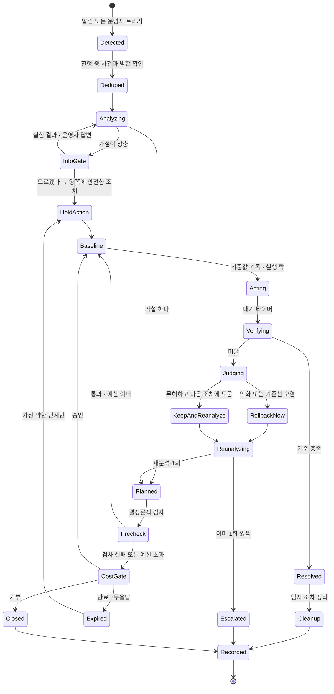
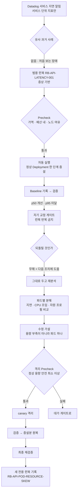
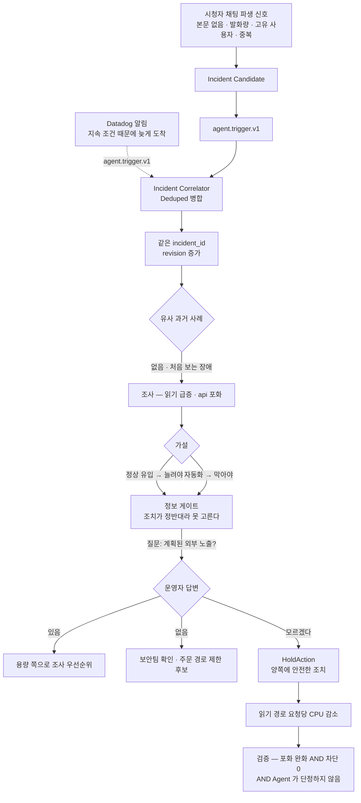

# 장애 시나리오 실험 — 복구 기준과 주입 설정

세 시나리오(채팅 총량 · 느린 파드 · 사람/봇 미확정)의 **흐름과, 재현 가능하게
돌리고 판정하기 위한 규칙**이다. 0절이 시나리오가 무엇인지, 1~3절이 어떻게
판정하고 무엇을 주입하는지다.

> 발표 구성·시연 순서·슬랙 메시지 문안은 저장소 밖 기획 문서에 있다.
> **여기에는 구현과 실험에 필요한 것만 둔다.**

> **수치는 여기에 확정하지 않는다.** 실측값은 전부 `docs/measurements.md` 가
> 원본이고 이 문서는 참조만 한다. 안 잰 값은 "안 쟀다" 로 남긴다 (`AGENTS.md`
> "숫자를 지어내지 않는다").

## 인덱스

| 절 | 무엇 |
|---|---|
| 0 | 시나리오 셋과 게이트 셋 — 정의, 공통 상태 머신, 시나리오별 흐름 |
| 1 | 복구 판정 — 규칙 둘, 시나리오별 기준 |
| 2 | 장애 주입 — 지켜야 할 것 넷, 시나리오별 설정 |
| 3 | 실행 사이 초기화 |

---

## 0. 시나리오 셋과 게이트 셋

### 0.1 게이트 — Agent 가 멈추는 세 가지 이유

**게이트는 "사람에게 넘기는 지점" 이고, 셋은 넘기는 이유가 다르다.**
축은 서로 겹치지 않는다 — 대가 / 증거 / 자기 신뢰.

| 게이트 | 진입 조건 | 사람에게 내미는 것 | 사람이 하는 일 |
|---|---|---|---|
| **대가** | 후보 조치의 `knob_reversible` 또는 `user_effect_reversible` 가 아니오이고 사전 승인 예산 밖 | 조치안 · 강도 선택지 · 조치 시 피해 · 방치 시 피해 · 만료 · 근거 · 배제 | 강도 선택 또는 거부 |
| **정보** | 둘 이상의 가설이 관측을 모두 설명하고 조치가 상충 | 가설별 가능성 · 근거 · 추가로 필요한 증거 · 질문 · 양쪽에 안전한 임시 조치 | 시스템 밖 사실 답변 또는 "모르겠다" |
| **자기 교정** | 조치 전 기준값 대비 검증 기준 미달 | 1차 가설과 검증 수치 · 되돌릴 것의 판정 · 재분석 결과 · 2차 조치 | 없음 (보고). 2차 조치가 Precheck 실패면 대가 게이트로 |

**"권한 게이트" 라고 부르지 않는다.** 진입 조건이 RBAC 권한이 아니라 **가역성**이다.

### 0.2 분류와 런북은 다른 축이다

| 축 | 값 | 기준 |
|---|---|---|
| 분류 | 알려진 장애 / 처음 보는 장애 | **과거에 같은 원인의 사례가 있는가** (S3 Vectors 유사도 임계) |
| 런북 | 전용(원인 기반) / 범용(증상 기반) / 없음 | 절차가 원인에 붙었나 증상에 붙었나 |

**런북을 썼다고 알려진 장애가 되는 것이 아니다.** 범용 런북은 원인을 몰라도 쓴다.
S2 가 그 경우다 — 처음 보는 장애인데 증상 기반 런북으로 시작한다.

### 0.3 시나리오 셋

| # | 진입 | 분류 | 게이트 | 장애 | 주 조치 |
|---|---|---|---|---|---|
| **S1** | Datadog | 알려진 | 대가 | 채팅 총량이 채널 감당 선 초과 → 전파 지연 | 채널 총량 제한 |
| **S2** | Datadog | 처음 보는 | 자기 교정 | Service 에 붙은 파드 하나만 CPU 조임 → 서비스 꼬리 지연 | 느린 파드 격리 |
| **S3** | 채팅 | 처음 보는 | 정보 | 읽기 급증. 사람인지 자동화인지 우리 데이터로 확정 불가 | 읽기 경로 버티기 |

### 0.4 공통 상태 머신

세 시나리오가 모두 이 위에서 돈다. 시나리오별 차이는 **어느 분기를 타는가**뿐이다.

지켜야 하는 것 넷.

| 상태 | 불변조건 |
|---|---|
| `Deduped` | 진입점이 둘이라 **같은 장애가 두 번 들어온다.** D-055의 결정론적 조건으로 같은 진행 중 사건에 붙이고, 모호하면 강제 병합하지 않는다 |
| `Baseline` | 기준값 기록 · 실행 락 · 멱등 키. **이것 없이 `Acting` 으로 가지 않는다** |
| `Verifying` | `verification_metrics` 로만 판정. **런북으로 시작했으면 그 런북이 지정한 지표로** |
| 런북 반복 금지 | 런북 조치가 검증 실패하면 **같은 절차를 다시 실행하지 않는다** |

`Judging` 의 세 갈래는 `diagnostic_contamination` 을 조회해 정한다.
**무조건 되돌리는 것이 규칙이 아니다** — 틀린 조치와 불완전한 조치는 다르다.

### 0.5 S1 흐름 — 대가 게이트

**첫 파동은 어떤 조치로도 못 막는다** — 알림→분석→승인→적용 사이에 단발 스파이크는
끝나 있다. 조치가 낮추는 것은 **지속 고원**이다. 그래서 검증도 적용 시각 이후만 센다.

### 0.6 S2 흐름 — 자기 교정 게이트

**재분석은 1회다.** 초과하면 `Escalated` 로 사람에게 넘긴다.
**최종 재검증까지가 조치의 끝이다** — 2.2 참조.

### 0.7 S3 흐름 — 정보 게이트

**채팅 본문을 Agent 에게 주지 않는다.** 시청자가 자유롭게 타이핑하는 유일한 입력이라
본문을 저장하면 프롬프트 인젝션 경로가 된다. 파생값만 쓴다.

| 무엇 | 어디 |
|---|---|
| 본문을 싣지 않는 근거 | `contracts.md` 5.3 "본문은 싣지 않는다" (설계 8.5 프롬프트 인젝션) |
| 파생 신호 스키마 | `contracts.md` 5.6 `chat.signal.v1` |
| Candidate 스키마 | `contracts.md` 5.7 `chat.incident_candidate.v1` |
| Candidate 생성·Incident 호출 정책 | `docs/chat-incident-candidate.md`, `docs/agent-entrypoint.md` 1.2, D-055 |

**Chat trigger 생성은 `CANDIDATE_CREATED`에서 한 번만이다**(D-050, D-055).
쿨다운 중 `CANDIDATE_UPDATED`는 저장만 한다. Agent는 source trigger가 아니라
`agent.incident.v1` revision을 받으며, 첫 cross-source 증거 같은 material change에만 후속
revision을 분석한다.

**진입점이 둘이 되면 Agent 호출 전에 병합 계층이 반드시 필요해진다**(0.4 `Deduped`, D-055).
채팅으로 하나, 알림으로 하나 들어오므로 합치지 않으면 같은 사건을 두 번 조사한다.

---

## 1. 복구 판정

### 1.1 규칙 둘

**① 계약 SLO 복귀 _AND_ 조치 직전 기준선 대비 개선, 둘 다 만족해야 한다.**

- SLO 만 보면 **부하가 저절로 빠져도 통과**한다. 자연 회복이 조치 효과로 기록된다.
- 기준선 개선만 보면 **여전히 계약 위반인데 "해결"** 이 된다.

`Baseline` 상태가 조치 직전 값을 찍는 이유가 이것이다.

**② 빨라졌나 + 안 망가뜨렸나, 둘 다 본다.**

지연만 보면 **"정상 사용자 절반을 차단해서 빨라진 것"** 이 성공이 된다.
그래서 **정상 사용자 차단률**을 항상 같이 판정한다.

> 검증 대기는 **60초 이상**. warm path 집계 창이 10초라 그보다 짧으면
> 창 하나가 튄 것으로 판정이 뒤집힌다.

### 1.2 시나리오별

| | 성공 | 놓치면 안 되는 것 |
|---|---|---|
| **S1** | 전파 p95 가 붕괴 전 구간으로 복귀 **AND** 정상 사용자 차단률이 상한 이내 | **효과는 조치 적용 시각 이후만 센다.** 첫 파동은 이미 지나가 있다. 채팅 전파 계약 기준이 저장소에 없다 — M-010 실측 형상을 기준선으로 쓴다 |
| **S2** | 격리 후 p95 가 **canary 붙이기 전** 값으로 복귀 | **증설분을 원복한 뒤에도 유지되어야 끝이다.** 남긴 채 회복하면 "결국 파드를 늘려서 나은 것" 을 배제할 수 없다. 1차 증설은 **실패해야 정상**이다 — p50 만 개선되고 p95 는 그대로 |
| **S3** | api 포화 완화 **AND** 정상 사용자 차단 **0** **AND** Agent 가 단정하지 않음 | 버티기라 "해결" 이 없다. **차단 0 이 버티기의 정의다.** 조치 효과는 조치 전/후로 `read-path.js` 를 같은 RPS 계단으로 돌려 M-009 포화점이 밀렸는지 본다 |

---

## 2. 장애 주입

### 2.1 지켜야 할 것 넷

| | |
|---|---|
| **부하 아니면 설정, 둘 중 하나로만** | 프로세스를 죽이거나 네트워크를 끊지 않는다. S1·S3 는 부하, S2 는 설정. FIS·Chaos Mesh 불필요 |
| **k6 에 식별용 표식을 붙이지 않는다** | 봉투에 실려(T-023) warm path 를 거쳐 **Agent 가 읽는 지표**가 된다. 표식은 곧 정답 라벨이다. S3 는 `ua_diversity` 가 판별 신호라 특히 치명적이다. `read-path.js` 에 지금 커스텀 헤더가 없다 — **넣지 않는다** |
| **콜드 캐시에서 시작하되 `stock:*` 은 지우지 않는다** | 재고는 Valkey 가 원본이다(D-07). 지우면 재고가 0 으로 표시되고 다음 주문 측정까지 망가진다. 비우려면 `kubectl rollout restart deploy/api` |
| **측정할 땐 모니터 Downtime, 주입할 땐 해제** | 안 재우면 측정 중에 Agent 가 깨어나 무언가 바꾼다 |

### 2.2 시나리오별

| | 무엇을 주입하나 | 안 하면 실패하는 것 |
|---|---|---|
| **S1** | `broadcast.js` 로 `아이템/s = 시청자 × 발화율` 을 M-010 붕괴점 위로. **연결 축**으로 올린다 — 같은 총량이면 연결이 많을수록 확실히 무너진다(M-010 해석 2) | **발화자를 넓게 퍼뜨린다.** 기존 조건(`발화자 수 = 채팅율 × 6`)은 발화자가 좁아 **1인 도배로 보인다.** 전제는 *전원이 한도 안인데 인원이 많아 총량이 넘는다* 이므로, 발화자를 늘리고 1인당 발화율을 낮춰 **전원이 `CHAT_RATE_PER_MIN` 아래**가 되게 한다. 파형은 **첫 파동 + 지속 고원** — 지금은 고정 발화율이라 추가해야 한다 |
| **S2** | canary Deployment 를 같은 Service 에 붙인다. main 과 **같은 이미지·같은 셀렉터, CPU 상한만** 낮게. 부하는 `read-path.js` 고정 도착률 | **CPU 상한 값 잡기** — 총 부하를 총 포화 아래로 두고, `파드당 RPS × M-009 기울기` 로 필요 CPU 를 구한 뒤 그보다 낮은 구간을 스윕해 **Ready 는 유지되면서 파드별 p95 가 이상치로 뜨는 값**을 고른다. 너무 낮으면 파드가 Service 에서 빠져 저절로 회복된다 — **canary 에만** `readinessProbe` 의 `timeoutSeconds`·`failureThreshold` 를 올려 창을 넓힌다 |
| **S3** | 읽기 스크립트를 사람/자동화 두 갈래로. **가르는 신호를 지우는 방향**으로 — 요청마다 새 세션 키, 클릭 이벤트 동반, 간격에 지터, UA 섞기 | 두 패턴이 쉽게 갈리면 정보 게이트가 안 열린다. 지표 이름은 `o2warm/metrics.py` 가 원본이다 |

**파드별 지연 지표는 새로 만들지 않는다.** 봉투에 `pod_name` 이 이미 있고(T-023)
warm path 가 이미 파드별로 집계한다(`sketch.py` 의 `cache_hit_by_pod`).
`latency` 만 같은 패턴으로 복제하면 된다. 파드 이상치 모니터도
`05-datadog/monitor.tf` 에 `outliers(… by {pod_name}, 'DBSCAN', …)` 로 있다.
**ALB 액세스 로그는 쓰지 않는다** — 전달 지연이 커서 실험 반복에 안 맞는다.

> **은폐와 범위는 다르다.** canary 설정값은 채점자 전용이지만 Agent 는 재분석에서
> `kubectl` 로 조회할 수 있어야 한다. **첫 알림 문맥에만 안 들어가면 된다.**

---

## 3. 실행 사이 초기화

| | |
|---|---|
| 노브 · 카운터 | `cfg:*` 삭제 · `chat:rate:*` · 채널 총량 카운터 |
| 파드 수 | main replicas 복원 · canary 제거 |
| 캐시 | Valkey 는 **메타 키만** — `stock:*` 금지 (2.1) |
| 시나리오 간섭 | S2 와 S3 가 같은 읽기 부하를 쓴다. S3 전 canary 제거 · S2 전 패턴 분기 해제 |
| **Datadog 모니터 상태** | **OK 로 돌아왔는지 확인하고 다음 실행을 시작한다.** ALERT 로 남아 있으면 다음 실행에서 알림이 다시 안 떠서 Agent 가 안 깨어난다 — **반복 실행에서 가장 자주 밟는다** |
| k6 | 누락 반복 수 0 인지 확인. 아니면 부하 생성기가 먼저 막힌 것이다 |
| 노드 | 부하 뒤 Karpenter 임시 노드가 남았는지 본다(D-051) |

> **파드 수를 조치 수단으로 쓸 때** — 매니페스트에서 `replicas` 를 빼야 Argo selfHeal 이
> 안 되돌린다(D-004, D-041). 대상에 **HPA·KEDA 를 붙이지 않는다** — 지금 ScaledObject 는
> `order-worker` 에만 있고 api 에는 없다.
