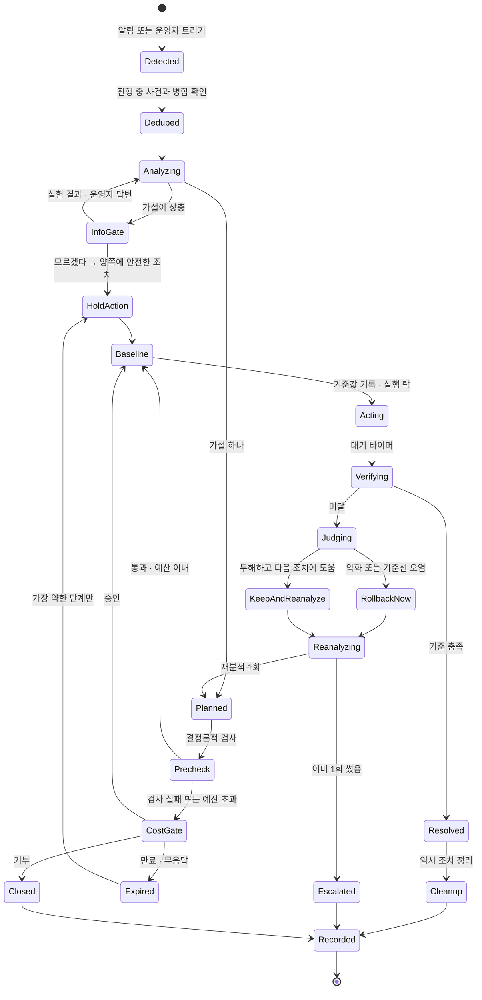
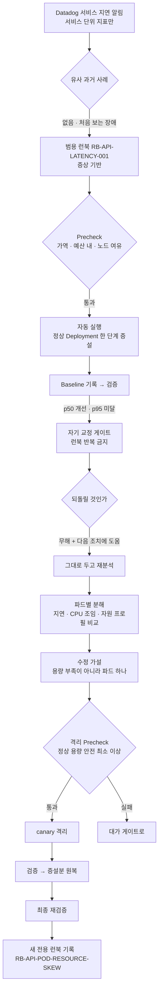
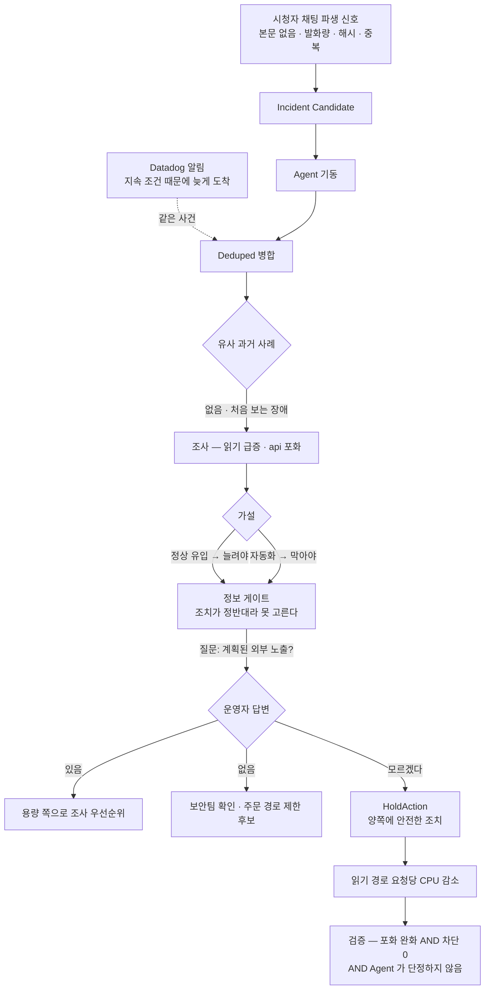

# 장애 시나리오 실험 — 복구 기준과 주입 설정

세 시나리오(채팅 총량 · 느린 파드 · 사람/봇 미확정)의 **흐름과, 재현 가능하게
돌리고 판정하기 위한 규칙**이다. 0절이 시나리오가 무엇인지, 1~5절이 어떻게
설정하고 무엇으로 판정하는지다.

> 발표 구성·시연 순서·슬랙 메시지 문안은 저장소 밖 기획 문서에 있다.
> **여기에는 구현과 실험에 필요한 것만 둔다.**

> **수치는 여기에 확정하지 않는다.** 실측값은 전부 `docs/measurements.md` 가
> 원본이고 이 문서는 참조만 한다. 안 잰 값은 "안 쟀다" 로 남긴다 (`AGENTS.md`
> "숫자를 지어내지 않는다").

## 인덱스

| 절 | 무엇 |
|---|---|
| 0 | 시나리오 셋과 게이트 셋 — 정의, 공통 상태 머신, 시나리오별 흐름 |
| 1 | 복구 기준을 정하는 규칙 — 원칙 넷, 지표 세 축 |
| 2 | 시나리오별 복구 기준 |
| 3 | 주입 설정 규칙 — 원칙 다섯 |
| 4 | 시나리오별 주입 설정 |
| 5 | 실행 사이 초기화 |
| 6 | 되돌리는 주체가 여럿이다 |

---

## 0. 시나리오 셋과 게이트 셋

### 0.1 게이트 — Agent 가 멈추는 세 가지 이유

**게이트는 "사람에게 넘기는 지점" 이고, 셋은 넘기는 이유가 다르다.**
축은 서로 겹치지 않는다 — 대가 / 증거 / 자기 신뢰.

| 게이트 | 진입 조건 | 사람에게 내미는 것 | 사람이 하는 일 |
|---|---|---|---|
| **대가** | 후보 조치의 `knob_reversible` 또는 `user_effect_reversible` 가 아니오이고 사전 승인 예산 밖 | 조치안 · 강도 선택지 · 조치 시 피해 · 방치 시 피해 · 만료 · 근거 · 배제 | 강도 선택 또는 거부 |
| **정보** | 둘 이상의 가설이 관측을 모두 설명하고 조치가 상충 | 가설별 가능성 · 근거 · 추가로 필요한 증거 · 질문 · 양쪽에 안전한 임시 조치 | 시스템 밖 사실 답변 또는 "모르겠다" |
| **자기 교정** | 조치 전 기준값 대비 검증 기준 미달 | 1차 가설과 검증 수치 · 되돌릴 것의 판정 · 재분석 결과 · 2차 조치 | 없음 (보고). 2차 조치가 Precheck 실패면 대가 게이트로 |

**"권한 게이트" 라고 부르지 않는다.** 진입 조건이 RBAC 권한이 아니라 **가역성**이다.

### 0.2 분류와 런북은 다른 축이다

| 축 | 값 | 기준 |
|---|---|---|
| 분류 | 알려진 장애 / 처음 보는 장애 | **과거에 같은 원인의 사례가 있는가** (S3 Vectors 유사도 임계) |
| 런북 | 전용(원인 기반) / 범용(증상 기반) / 없음 | 절차가 원인에 붙었나 증상에 붙었나 |

**런북을 썼다고 알려진 장애가 되는 것이 아니다.** 범용 런북은 원인을 몰라도 쓴다.
S2 가 그 경우다 — 처음 보는 장애인데 증상 기반 런북으로 시작한다.

### 0.3 시나리오 셋

| # | 진입 | 분류 | 게이트 | 장애 | 주 조치 |
|---|---|---|---|---|---|
| **S1** | Datadog | 알려진 | 대가 | 채팅 총량이 채널 감당 선 초과 → 전파 지연 | 채널 총량 제한 |
| **S2** | Datadog | 처음 보는 | 자기 교정 | Service 에 붙은 파드 하나만 CPU 조임 → 서비스 꼬리 지연 | 느린 파드 격리 |
| **S3** | 채팅 | 처음 보는 | 정보 | 읽기 급증. 사람인지 자동화인지 우리 데이터로 확정 불가 | 읽기 경로 버티기 |

### 0.4 공통 상태 머신

세 시나리오가 모두 이 위에서 돈다. 시나리오별 차이는 **어느 분기를 타는가**뿐이다.



지켜야 하는 것 넷.

| 상태 | 불변조건 |
|---|---|
| `Deduped` | 진입점이 둘이라 **같은 장애가 두 번 들어온다.** 같은 대상·같은 증상의 진행 중 사건과 병합한다 |
| `Baseline` | 기준값 기록 · 실행 락 · 멱등 키. **이것 없이 `Acting` 으로 가지 않는다** |
| `Verifying` | `verification_metrics` 로만 판정. **런북으로 시작했으면 그 런북이 지정한 지표로** |
| 런북 반복 금지 | 런북 조치가 검증 실패하면 **같은 절차를 다시 실행하지 않는다** |

`Judging` 의 세 갈래는 `diagnostic_contamination` 을 조회해 정한다.
**무조건 되돌리는 것이 규칙이 아니다** — 틀린 조치와 불완전한 조치는 다르다.

### 0.5 S1 흐름 — 대가 게이트


**첫 파동은 어떤 조치로도 못 막는다** — 알림→분석→승인→적용 사이에 단발 스파이크는
끝나 있다. 조치가 낮추는 것은 **지속 고원**이다. 그래서 검증도 적용 시각 이후만 센다.

### 0.6 S2 흐름 — 자기 교정 게이트



**재분석은 1회다.** 초과하면 `Escalated` 로 사람에게 넘긴다.
**최종 재검증까지가 조치의 끝이다** — 2.2 참조.

### 0.7 S3 흐름 — 정보 게이트



**채팅 본문을 Agent 에게 주지 않는다.** 시청자가 자유롭게 타이핑하는 유일한 입력이라
본문을 저장하면 프롬프트 인젝션 경로가 된다. 파생값만 쓴다.

| 무엇 | 어디 |
|---|---|
| 본문을 싣지 않는 근거 | `contracts.md` 5.3 "본문은 싣지 않는다" (설계 8.5 프롬프트 인젝션) |
| 파생 신호 스키마 | `contracts.md` 5.6 `chat.signal.v1` |
| Candidate 스키마 | `contracts.md` 5.7 `chat.incident_candidate.v1` |
| Candidate 생성·호출 정책 | `docs/chat-incident-candidate.md`, `docs/agent-entrypoint.md` 1.2 |

**Agent 호출은 `CANDIDATE_CREATED` 에서 한 번만이다**(D-050, `agent-entrypoint.md` 1.2).
쿨다운 중 `CANDIDATE_UPDATED` 는 저장만 하고 다시 호출하지 않는다 —
채팅 한 건마다 Agent 를 부르지 않는다.

**진입점이 둘이 되면 병합이 반드시 필요해진다**(0.4 `Deduped`).
채팅으로 하나, 알림으로 하나 들어오므로 합치지 않으면 같은 사건을 두 번 조사한다.

---

## 1. 복구 기준을 정하는 규칙

### 1.1 원칙 넷

| 원칙 | 어기면 |
|---|---|
| **① 절대 임계 하나로 판정하지 않는다.** 계약 SLO 복귀 **AND** 조치 직전 기준선 대비 개선, 둘 다 요구한다 | SLO 만 쓰면 부하가 저절로 빠져도 통과한다 — 자연 회복이 조치 효과로 둔갑한다. 델타만 쓰면 나아졌지만 여전히 계약 위반인데 "해결" 이 된다 |
| **② 지표는 세 축이다** (1.2) | "절반을 차단해서 빨라진 것" 이 성공으로 기록된다 |
| **③ 판정 창 = 조치 반영 + 지표 집계 창 × 2 이상** | 창 하나가 튄 것으로 판정이 뒤집힌다 |
| **④ 효과 측정 구간은 조치 적용 시각 이후만** | 조치 전 데이터가 창에 섞여 효과가 희석된다 |

③ 의 집계 창은 warm path 가 **10초**다 — `O2_WARM_WINDOW` 기본값
(`infra/06-datastream/warm/src/o2warm/settings.py`). 여기에 Datadog 전송·평가
지연이 얹힌다. 검증 대기를 60초 아래로 두면 창이 몇 개 안 들어가 흔들린다.

**실패 기준을 성공 기준보다 먼저 쓴다.** 순서를 바꾸면 사후 합리화가 된다.

### 1.2 지표 세 축

| 축 | 무엇 | 없으면 |
|---|---|---|
| 효율 | p95 · p99 · 포화 지표 | — |
| 정확 | 오류율 · 타임아웃 · **정상 사용자 차단률** | 차단해서 빨라진 것을 성공으로 센다 |
| 범위 | 조치가 **안 건드린** 경로가 그대로인가 (주문 성공률 등) | 옆 경로를 망가뜨린 것을 못 본다 |

---

## 2. 시나리오별 복구 기준

### 2.1 S1 채팅 총량 — "복구" 가 아니라 감내 가능한 열화

조치(채널 총량 제한)가 발화를 **거부**하므로 완전 복구가 구조적으로 없다.
전파는 회복되는데 일부 시청자는 말을 못 한다. 판정 이름을 "해결" 로 쓰지 않는다.

| 축 | 기준 | 정하는 방법 |
|---|---|---|
| 효율 | 적용 시각 이후 전파 p95 가 붕괴 전 구간으로 복귀 | **채팅 전파 계약 기준이 저장소에 없다.** `architecture.md` 12.1 의 `p95 < 800ms` 는 읽기 경로용이다. M-010 의 실측 형상을 기준선으로 쓴다 |
| 효율 보조 | 인입 아이템/s 가 감당 선 아래 | M-010 의 2파드 안전선. **파드 수를 바꾸면 다시 잰다** |
| 정확 | 정상 사용자 차단 비율이 상한 이내 | **이 값이 없으면 성공 판정 자체가 성립하지 않는다.** 조치 강도별로 잰다 |
| 실패 | 지속 구간이 안 내려감 **또는** 내려갔는데 차단률 초과 | — |

`아이템/s = 시청자 × 채팅율` 이 지배 변수라는 것과 같은 총량에서 연결이 많을수록
나쁘다는 것은 M-010 해석 1·2 에 있다.

### 2.2 S2 느린 파드 — 검증이 두 번이고 성격이 반대다

| 단계 | 기준 | 비고 |
|---|---|---|
| **1차 검증** | p50 이 기준선 대비 유의하게 개선 **AND** p95 는 사실상 그대로 | **"예상대로 실패했는가" 가 성공 기준이다.** p95 가 우연히 좋아질 수 있으므로 반복 재현에서 대부분 동일할 것을 조건에 넣는다 |
| **2차 검증** | 격리 후 서비스 p95 가 기준선 범위로 복귀 · 타임아웃 정상 · 파드별 p95 편차 축소 | 여기서 **기준선은 canary 를 붙이기 전** 정상 파드만으로 잰 값이다. 이것이 원점 |
| **최종 재검증** | **증설분을 원복한 뒤에도** p95 가 유지되는가 | 증설분을 남긴 채 회복하면 "결국 파드를 늘려서 나은 것" 을 배제할 수 없다. **원복 후 유지가 "용량이 아니라 그 파드였다" 의 유일한 증거다** |

### 2.3 S3 사람/봇 미확정 — 기준이 지표가 아니라 Agent 행동이다

버티기 조치라 "해결" 이 없다. 성공은 *고쳤나* 가 아니라 *안 고르고 버텼나* 다.

| 축 | 기준 | 정하는 방법 |
|---|---|---|
| **행동** (1순위) | 한쪽으로 단정하지 않음 · 필요한 증거를 명시 · 확정 전 차단 미실행 | 출력 계약 항목이 전부 채워졌는지로 판정. 사람이 읽고 채점 |
| 정확 | 정상 사용자 차단 **0** | 버티기의 정의다. 0 이 아니면 버티기가 아니다 |
| 효율 | api 포화점이 얼마나 밀렸는가 | 조치 전/후로 `loadtest/read-path.js` 를 **같은 RPS 계단**으로 돌려 M-009 의 포화점이 어디로 이동했는지 본다 |
| 구분 불가 | 분류기가 무작위 수준 | Run A/B 관측 데이터를 학습하지 않은 단순 분류기에 넣는다. **오프라인 계산이라 시연에는 못 넣는다** |

> **효율 축이 0 으로 나오면 S3 의 조치가 통째로 무의미해진다.** 읽기 경로 병목은
> DB 나 캐시가 아니라 api 프로세스의 CPU 천장이므로(M-009 해석), 줄일 비용이
> **왕복이 아니라 CPU** 인지 먼저 확인한다. 동기 라우트의 Valkey 왕복은
> uvicorn 스레드풀에서 돌아 이벤트 루프를 막지 않는다
> (`apps/api/app/core/cache.py` 상단 주석).

---

## 3. 주입 설정 규칙

| 원칙 | 왜 |
|---|---|
| **① 부하 아니면 설정, 둘 중 하나로만** | 프로세스를 죽이거나 네트워크를 끊는 주입은 쓰지 않는다. FIS·Chaos Mesh 불필요 |
| **② k6 요청이 평범한 클라이언트처럼 보여야 한다** | 아래 참조 |
| **③ 콜드 캐시에서 시작** | `architecture.md` 12.1 전제 1번 |
| **④ 측정 단계엔 모니터 Downtime, 주입 단계엔 해제** | `@webhook-dify` 모니터가 6개고 부하가 그중 넷을 때린다. 안 재우면 측정 중에 Agent 가 깨어나 무언가 바꾼다 |
| **⑤ 부하 생성기가 먼저 막히지 않았는지 매번 확인** | k6 누락 반복 수 0. M-009 의 첫 400 RPS 측정을 버린 이유가 `preAllocatedVUs` 부족이었다 |

### 3.1 ② 가 특히 중요한 이유

`loadtest/read-path.js` 에는 지금 커스텀 헤더가 없다. **넣지 않는다.**

이벤트 봉투에 `pod_name` 을 비롯한 식별 필드가 실리고(T-023), 그것이 warm path
집계를 거쳐 Agent 가 읽는 지표가 된다. 부하 생성기 표식을 붙이면 **Agent 입장에서
그것이 정답 라벨**이 된다. S3 는 `ua_diversity` 가 자동화 판별 신호라 특히 치명적이다.

### 3.2 ③ 의 금지 사항

캐시를 비울 때 **`stock:*` 은 지우지 않는다.** 재고는 Valkey 가 원본이다(D-07).
지우면 재고가 0 으로 표시되고 다음 주문 측정까지 망가진다.
인프로세스 캐시는 `LOCAL_TTL` 이 1초라 저절로 만료되고, 확실히 비우려면
`kubectl rollout restart deploy/api` 를 쓴다. 근거는 `loadtest/read-path.js` 상단 주석.

---

## 4. 시나리오별 주입 설정

### 4.1 S1 — 연결 축으로 무너뜨린다

목표는 `아이템/s = 시청자 × 채팅율` 을 M-010 의 붕괴점 위로 올리는 것이다.
같은 총량이면 **연결이 많은 쪽이 확실하게 무너진다** — 프레임마다 직렬화가 한 번
돌기 때문이다(M-010 해석 2, `apps/chat-gateway/src/main.ts` 틱 루프).

| 설정할 것 | 어떻게 |
|---|---|
| 연결 수 · 발화율 | M-010 의 붕괴 조합을 출발점으로 |
| **발화자 분포 — 반드시 고친다** | `loadtest/broadcast.js` 의 M-010 조건은 `발화자 수 = 채팅율 × 6` 이라 발화자가 좁다. 그대로 쓰면 **1인 도배로 보인다.** S1 의 전제는 *전원이 사용자별 한도 안에 있는데 인원이 많아 총량이 넘는다* 이므로, **발화자 수를 크게 늘리고 1인당 발화율을 낮춰 전원이 `CHAT_RATE_PER_MIN` 아래**가 되게 배치한다 |
| **파형 — 추가해야 한다** | 지금은 고정 발화율이다. 첫 파동(스파이크) → 지속 고원이 있어야 "첫 파동은 반응형 조치로 못 막는다" 와 "조치는 고원을 낮춘다" 가 분리되어 보인다 |
| 대조군 | 단발 동시와 지속 고원을 각각 돌려 사용자별 노브와 채널 노브 중 어느 쪽이 듣는지 보인다 |

채널 총량 카운터를 만들 때 **파드 로컬로 만들지 않는다.** chat-gateway 가
2 replicas 라 로컬 카운터면 실제 상한이 두 배가 된다. `main.ts` 의
`overRateLimit()` 이 쓰는 Valkey `INCR` + `EXPIRE` 패턴을 그대로 쓴다.

### 4.2 S2 — 부하는 평범하게, 설정으로 만든다

CPU 상한 값을 잡는 절차. M-009 의 선형 구간 기울기(`api CPU / RPS`)를 쓴다.

```
1  총 부하를 총 포화 아래로 정한다
   (전체가 포화하면 진짜 용량 부족이 섞여 인과가 더러워진다)
2  파드당 RPS  = 총 부하 ÷ 파드 수
3  파드당 필요 CPU = 파드당 RPS × (M-009 기울기)
4  CPU 상한을 필요치보다 낮은 구간에서 스윕한다
5  Ready 는 유지되면서 파드별 p95 가 이상치로 뜨는 값을 고른다
```

| 설정할 것 | 어떻게 |
|---|---|
| canary Deployment | main 과 같은 이미지·같은 Service 셀렉터, **CPU 상한만** 낮게 |
| CPU 상한 | 위 절차로 스윕. CFS 주기가 100ms 라 상한이 낮을수록 지연이 계단식으로 튄다 |
| readinessProbe | **canary 에만** `timeoutSeconds`·`failureThreshold` 를 올린다. 안 그러면 파드가 Service 에서 빠져 저절로 회복되거나 들락날락한다 |
| 트래픽 도착 확인 | Service endpoints 포함 여부 + 파드별 요청 수 |

**파드별 지연 지표는 새로 발명하지 않는다.** 봉투에 `pod_name` 이 이미 있고(T-023),
warm path 가 이미 파드별로 집계한다(`o2warm/sketch.py` 의 `cache_hit_by_pod`).
`latency` 는 같은 함수에서 `pod_name` 을 인자로 받으면서 파드별로만 안 나뉜다 —
`cache_hit_rate_by_pod` 패턴을 그대로 복제한다. 파드 단위 이상치 모니터도
`infra/05-datadog/monitor.tf` 에 `outliers(… by {pod_name}, 'DBSCAN', …)` 로 이미 있다.
**ALB 액세스 로그는 쓰지 않는다** — S3 전달 지연이 커서 실험 반복에 맞지 않는다.

> **은폐와 범위는 다르다.** canary 설정값은 채점자 전용이지만 Agent 는 재분석
> 단계에서 `kubectl` 로 조회할 수 있어야 한다. **첫 알림 문맥에만 안 들어가면 된다** —
> 알림의 범위가 원래 서비스 단위인 것이지 증거를 숨긴 것이 아니다.

### 4.3 S3 — 두 패턴을 닮게 만드는 것이 전부다

가르는 신호를 하나씩 지우는 방향으로 설계한다.

| 가르는 신호 | 자동화 쪽에서 해야 할 것 |
|---|---|
| 세션 키 집중도 | 요청마다 새 키 — 클라이언트가 만들기 때문에 가능하다 (`contracts.md` 1.2) |
| `click_ratio` | 클릭 이벤트도 같이 발행 — 수집이 인증 없이 열려 있다 (`contracts.md` 2.5) |
| `interval_cv` | 요청 간격에 지터 |
| `ua_diversity` · `ip_diversity` | UA 를 섞는다 |

지표 이름은 `o2warm/metrics.py` 가 원본이다.

**S2 와 S3 가 같은 읽기 부하를 쓴다.** S3 를 돌릴 때 canary 가 남아 있으면 안 되고,
S2 를 돌릴 때 두 패턴 분기가 켜져 있으면 안 된다. 5절 목록에 넣는다.

---

## 5. 실행 사이 초기화

| 무엇 | 어떻게 |
|---|---|
| 노브 | `cfg:*` 키 삭제 |
| 파드 수 | main replicas 복원 · canary 제거 |
| 캐시 | 인프로세스는 1초라 저절로 만료. Valkey 는 메타 키만 — **`stock:*` 금지** (3.2) |
| 카운터 | `chat:rate:*` · 채널 총량 카운터 |
| 시나리오 간섭 | S3 전 canary 제거 확인 · S2 전 패턴 분기 해제 확인 |
| **Datadog 모니터 상태** | **OK 로 돌아왔는지 확인하고 다음 실행을 시작한다.** ALERT 로 남아 있으면 다음 실행에서 알림이 다시 발생하지 않아 Agent 가 안 깨어난다. 실험을 여러 번 반복할 때 가장 자주 밟는다 |
| Karpenter 잔여 노드 | 부하 뒤 임시 노드가 남았는지 본다. D-051 의 사례가 있다 |

---

## 6. 되돌리는 주체가 여럿이다

파드 수를 조치 수단으로 쓸 때 우리 말고도 되돌리는 주체가 있다.

| 주체 | 무엇을 되돌리나 | 대응 |
|---|---|---|
| Argo CD | 매니페스트 값으로 replicas 복원 | 대상 Deployment 의 replicas 필드를 동기화 예외로 둔다 |
| HPA | 자기 계산값으로 | **대상에 붙이지 않는다** |
| KEDA | ScaledObject 대상에 한해 | 현재 `order-worker` 에만 붙어 있다(`O2-live-deploy/order-worker-scaledobject.yaml`). **api 에는 없다** — 실험 중 붙이지 않는다 |
| Karpenter | 노드를 늘리고 줄인다 | 증설 조치가 노드 프로비저닝을 유발하면 타이밍이 실험마다 달라진다. 증설 슬롯이 **기존 노드 안에** 있는지 먼저 확인한다 |

Karpenter·KEDA 의 도입 근거와 경계는 D-051 에 있다.
