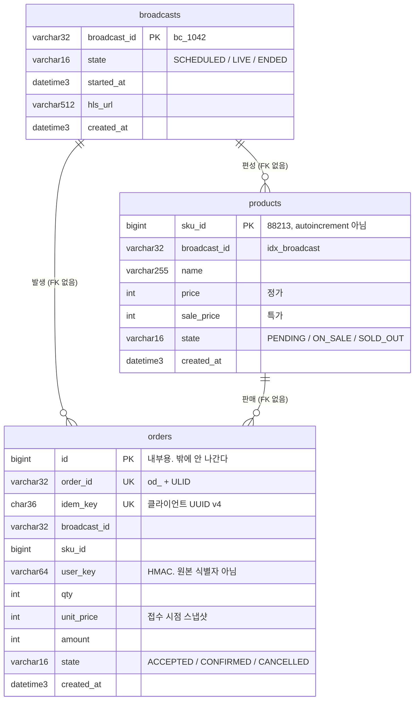

# 데이터 스키마

이 서비스의 상태는 **MySQL과 Valkey 두 곳에** 나뉘어 있다. 어느 쪽이 원본인지
헷갈리면 재고가 틀어지므로, 그 경계를 먼저 적는다.

REST·WebSocket 규격은 `contracts.md`, 왜 이렇게 나눴는지는
`architecture.md` 의 D-07(재고 판정)과 4.5 에 있다. **두 자리 `D-07` 은
`architecture.md` 번호다** — `decisions.md` 에는 없다.

## 인덱스

| 절 | 내용 |
|---|---|
| [1. 저장소 경계](#1-저장소-경계) | 무엇이 어디에 사는가 |
| [2. ERD](#2-erd) | 테이블 관계 |
| [3. MySQL 테이블](#3-mysql-테이블) | `broadcasts` · `products` · `orders` |
| [4. Valkey 키](#4-valkey-키) | 재고·멱등·세션 |
| [5. 설계 결정](#5-설계-결정) | FK 없음, ENUM 없음, DATETIME(3) |
| [6. 마이그레이션](#6-마이그레이션) | Alembic 운용 |

---

## 1. 저장소 경계

| 데이터 | 원본 | 사본 |
|---|---|---|
| 방송·상품 편성 | **MySQL** | Valkey `bcast:{id}:meta` (30s), 파드 로컬 LRU (1s) |
| **재고** | **Valkey `stock:{sku}`** | 없음. MySQL에 재고 컬럼이 **없다** |
| 확정 주문 | **MySQL `orders`** | Valkey `order:{id}` (접수 직후 임시) |
| 멱등 판정 | MySQL `uk_idem` (최종) | Valkey `idem:{key}` (1차, 600s) |

재고가 Valkey에 있는 이유는 MySQL 행 잠금이 SKU 하나당 약 100 TPS 에서
막히기 때문이다. 특가 오픈은 그 6배로 들어온다 (`architecture.md` 4.5).

**MySQL `products` 에 재고 컬럼을 추가하지 않는다.** 두 개가 되는 순간
어느 쪽이 맞는지 아무도 모르게 된다.

멱등은 반대로 **두 곳에 둔다.** SQS Standard 가 최소 1회 전달이라 워커가 같은
메시지를 두 번 받는 것이 정상 동작이고, Valkey 키가 만료된 뒤 재전달이 오면
`uk_idem` 만 그것을 막을 수 있다. 사본이 아니라 서로 다른 시점을 막는
두 개의 방어선이다.

---

## 2. ERD



관계선은 그렸지만 **외래 키 제약은 걸지 않았다.** 5.1 참조.

---

## 3. MySQL 테이블

물리 스키마의 원본은 `apps/api/migrations/versions/`의 Alembic 이력이다.
`apps/api/app/models/`는 애플리케이션 매핑이며 둘이 항상 일치해야 한다. 이 문서는
둘을 사람이 읽기 쉽게 설명한 것이므로, 어긋나면 문서를 코드에 맞춰 덮기 전에
마이그레이션 누락인지 모델 누락인지부터 확인한다.

### 3.1 `broadcasts`

방송 편성. `contracts.md` 2.1 스냅샷의 상위 객체.

| 컬럼 | 타입 | NULL | 비고 |
|---|---|---|---|
| `broadcast_id` | `VARCHAR(32)` | N | **PK.** 계약이 정한 공개 ID (`bc_1042`) |
| `state` | `VARCHAR(16)` | N | `SCHEDULED` / `LIVE` / `ENDED` |
| `started_at` | `DATETIME(3)` | Y | 아직 시작 안 했으면 NULL |
| `hls_url` | `VARCHAR(512)` | Y | CloudFront 가 서빙하는 HLS |
| `created_at` | `DATETIME(3)` | N | `DEFAULT CURRENT_TIMESTAMP(3)` |

공개 ID 를 그대로 PK 로 쓴다. URL 에 드러나고 바뀌지 않으므로 내부 PK 를 따로
둘 이유가 없다.

### 3.2 `products`

**재고 컬럼이 없다. 누락이 아니다** (1절).

| 컬럼 | 타입 | NULL | 비고 |
|---|---|---|---|
| `sku_id` | `BIGINT` | N | **PK, autoincrement 아님.** 편성 시 부여 |
| `broadcast_id` | `VARCHAR(32)` | N | `idx_broadcast` |
| `name` | `VARCHAR(255)` | N | |
| `price` | `INT` | N | 정가 (원) |
| `sale_price` | `INT` | N | 특가 (원) |
| `state` | `VARCHAR(16)` | N | `PENDING` / `ON_SALE` / `SOLD_OUT` |
| `created_at` | `DATETIME(3)` | N | `DEFAULT CURRENT_TIMESTAMP(3)` |

금액은 정수다. 원화는 소수점이 없다. `DECIMAL` 이 필요해지면 그때 바꾼다.

`sku_id` 는 JSON 에서 문자열(`"88213"`)이고 저장은 정수다. 직렬화 시점에
바꾼다 (`contracts.md` 1.2).

**인덱스**

| 이름 | 컬럼 | 이유 |
|---|---|---|
| `idx_broadcast` | `broadcast_id` | 조회가 방송 단위로만 들어온다 |

### 3.3 `orders`

| 컬럼 | 타입 | NULL | 비고 |
|---|---|---|---|
| `id` | `BIGINT` | N | **PK, AUTO_INCREMENT.** 내부용 |
| `order_id` | `VARCHAR(32)` | N | **UK `uk_order_id`.** `od_` + ULID |
| `idem_key` | `CHAR(36)` | N | **UK `uk_idem`.** 클라이언트 UUID v4 |
| `broadcast_id` | `VARCHAR(32)` | N | |
| `sku_id` | `BIGINT` | N | |
| `user_key` | `VARCHAR(64)` | N | 세션 토큰의 HMAC |
| `qty` | `INT` | N | |
| `unit_price` | `INT` | N | **접수 시점 스냅샷** |
| `amount` | `INT` | N | `unit_price × qty` |
| `state` | `VARCHAR(16)` | N | `ACCEPTED` / `CONFIRMED` / `CANCELLED` |
| `created_at` | `DATETIME(3)` | N | `DEFAULT CURRENT_TIMESTAMP(3)` |

`id` 와 `order_id` 가 따로 있는 이유: 내부 PK 를 노출하면 주문량이 밖에서
세어진다.

**`user_key` 에 원본 식별자가 저장되지 않는다.** 로그인이 없어 클라이언트가
만든 세션 토큰을 쓰는데, SDK 가 HMAC 으로 바꾼 값만 담는다. 이벤트 봉투의
`user_key` 와 같은 값이라 로그와 DB 를 이 키로 이을 수 있다.

이 일치는 세 서비스가 같은 `O2_EVENTS_SALT`를 쓸 때만 보장된다. 클러스터에서는
Secret `o2-events`가 그 값을 나르고(D-027), 로컬은 Compose 기본값을 쓴다.

HMAC 적용 전 만들어진 개발 주문에는 원본 세션 키나 빈 문자열이 남아 있을 수
있다. salt에 의존하는 데이터 변환을 Alembic에 넣지 말고, 운영 데이터가 생기기
전에 별도 정리 작업으로 폐기하거나 변환한다.

**`unit_price` 를 남기는 이유.** 워커가 처리 시점에 가격을 다시 조회하면,
큐가 밀린 사이 가격이 바뀌었을 때 사용자가 화면에서 본 금액과 청구 금액이
달라진다. 계약에 가격 변경 푸시(`product.update`)가 있으므로 실제로 일어난다.
큐가 밀릴수록 간격이 벌어진다.

`amount` 만 두지 않은 이유는, 나중에 "수량이 많았나 비쌌나" 를 되짚을 수
없기 때문이다.

**인덱스**

| 이름 | 컬럼 | 이유 |
|---|---|---|
| `uk_idem` | `idem_key` | **중복 주문 최종 방어선** |
| `uk_order_id` | `order_id` | 공개 ID 조회 |
| `idx_sku_created` | `sku_id`, `created_at` | 상품별 판매 추이 |

`uk_idem` 이 왜 최종 방어선인지는 1절.

### 3.4 모델 정의가 두 곳에 있다

`apps/order-worker/worker/models.py` 에도 `orders` 매핑이 있다.
**그쪽은 원본이 아니다** — INSERT 에 필요한 만큼만 적어둔 사본이고,
테이블 정의와 마이그레이션은 `apps/api` 가 소유한다.

**order-worker 에서 `alembic autogenerate` 를 돌리면 안 된다.** 거기 없는
컬럼을 DROP 하는 마이그레이션이 만들어진다.

공용 패키지로 빼지 않은 이유는 CI 빌드 컨텍스트가 `apps/<service>` 라
서비스가 남의 폴더를 못 보기 때문이다. 파이썬 서비스가 셋째가 되거나 스키마
변경이 잦아지면 그때 뽑는다.

---

## 4. Valkey 키

전체 목록과 TTL 은 `contracts.md` 4 가 원본이다. 여기서는 **저장 구조만**
적는다.

### `stock:{sku}` — 재고 원본

```
stock:88213 → "47"        String, TTL 없음
```

**TTL 을 걸지 않는다. 만료되는 순간 재고가 소실된다.** 현재는 종료 재고를
영속화할 MySQL 테이블과 배치가 없으므로 방송이 끝났다는 이유만으로 삭제하지
않는다. 목적지 스키마와 reconciliation 절차를 먼저 정한 뒤 삭제를 구현한다.

축출 정책은 `volatile-lru` — TTL 이 있는 키만 축출 대상이라, 메모리가 차도
이 키는 살아남는다. `allkeys-lru` 로 바꾸면 재고가 조용히 사라진다.

차감은 `reserve_stock.lua` 가 원자적으로 한다. 반환값:

| 반환 | 뜻 | API 응답 |
|---|---|---|
| `{1, order_id}` | 이미 처리된 멱등 키 | 202 (같은 `order_id`) |
| `{0, 남은수량}` | 차감 성공 | 202 |
| `{-1, ""}` | 재고 부족 | 409 `SOLD_OUT` |
| `{-2, ""}` | **키 자체가 없음** | 500 `INTERNAL_ERROR` |

`-1` 과 `-2` 를 구분하는 것이 중요하다. "다 팔렸다" 와 "초기화가 안 됐다" 는
증상이 같지만 조치가 정반대다.

### `idem:{key}` — 멱등 1차 방어선

```
idem:9f8e...  → "od_01J..."     String, TTL 600s
```

Lua 안에서 재고 차감과 **같은 원자 단위로** 기록된다. 발행 실패 시
`_compensate()` 가 이 키를 지우고 재고를 되돌린다.

### `order:{order_id}` — 접수 기록

```
order:od_01J... → {"sku_id":"88213","qty":1,"state":"ACCEPTED"}   TTL 600s
```

워커가 MySQL 에 쓰기 전까지 `GET /api/orders/{id}` 가 읽을 값. MySQL 을 먼저
보고 없으면 여기를 본다.

> **알려진 구멍.** 이 키는 Lua 밖, SQS 발행 **뒤에** 기록된다
> (`order.py` 181 → 187). 그 사이에 파드가 죽으면 재고는 줄었는데 조회는
> 404 가 된다. Lua 안으로 옮기는 것이 예정돼 있다.

### 그 밖

| 키 | 타입 | 상태·용도 |
|---|---|---|
| `bcast:{id}:meta` | String(JSON) | 구현됨. 스냅샷 메타 캐시 30s |
| `chat:{bcast}` | Pub/Sub | 구현됨. 채팅 팬아웃 |
| `chat:rate:{bcast}:{user}` | Integer | 구현됨. 채팅 제한 60s |
| `sku:{id}:detail` | String(JSON) | 예정. 상품 상세 캐시 60s |
| `sess:{token}` | Hash | 예정. 세션 1800s |
| `room:{bcast}:pods` | Set | 예정. 파드 목록 60s |
| `cache:invalidate` | Pub/Sub | 예정. 캐시 무효화 |

---

## 5. 설계 결정

### 5.1 외래 키를 걸지 않는다

`products.broadcast_id`, `orders.*` 모두 FK 가 없다.

FK 검사는 부모 행에 공유 잠금을 잡지만 공유 잠금끼리는 호환되므로, 같은 부모를
참조하는 INSERT가 무조건 직렬화된다고 표현하는 것은 정확하지 않다. 여기서 FK를
두지 않은 이유는 주문 핫패스가 부모 행의 변경·삭제와 결합되는 것을 피하고,
서비스 경계를 넘는 참조 무결성을 애플리케이션에서 관리하기 위해서다.

주문 접수는 방송 스냅샷에서 `broadcast_id`와 `sku_id`의 편성을 확인한다.
DB에는 조회용 인덱스만 두고, 누락·고아 데이터는 reconciliation으로 탐지한다.

### 5.2 상태 컬럼에 ENUM 을 쓰지 않는다

ENUM 변경이 항상 테이블 재작성인 것은 아니지만, 값의 삽입 위치와 MySQL 버전에
따라 적용 방식이 달라지고 상태 추가가 DB 마이그레이션과 결합된다. 상태는
애플리케이션 계약이므로 `VARCHAR(16)`으로 저장하고 Pydantic의 `Literal` 및 내부
상태 전이 코드에서 검증한다.

### 5.3 `DATETIME(3)` — 밀리초를 지킨다

주문 순서를 초 단위로 보면 같은 초에 수백 건이 들어와 구분되지 않는다.

**두 가지가 조용히 깨진다:**

```python
DateTime(3)              # timezone=3 으로 해석된다. 밀리초가 사라진다
DATETIME(fsp=3)          # 이것이 맞다

server_default=func.now(3)          # "Invalid default value" 로 거부된다
server_default=text("CURRENT_TIMESTAMP(3)")   # 이것이 맞다
```

`apps/api/app/models/types.py` 에 `DT3` / `NOW3` 로 모아뒀다. 새 컬럼은
그것을 쓴다.

**모델에 `server_default` 를 반드시 적는다.** 안 적으면 SQLAlchemy 가 컬럼을
INSERT 문에 넣고 NULL 을 명시적으로 보내, DB 기본값이 적용되지 않는다.
order-worker 가 이것 때문에 모든 주문을 `IntegrityError` 로 삼킨 적이 있다.

---

## 6. 마이그레이션

Alembic. `apps/api/migrations/versions/`.

| 리비전 | 내용 |
|---|---|
| `6ba206d5374d` | 초기 스키마 |
| `ccdd5120aa51` | `orders.unit_price` · `orders.amount` 추가 |

`ccdd5120aa51`은 당시 `orders`가 비어 있다는 전제에서 NOT NULL 컬럼을 바로
추가했다. 앞으로 운영 데이터가 있는 테이블에 필수 컬럼을 추가할 때는
nullable 추가 → backfill → NOT NULL 전환 순서로 새 리비전을 만든다.

이미지에 `alembic.ini` 와 `migrations/` 가 들어간다. 넣지 않으면
`No 'script_location'` 로 실패한다. `alembic.ini` 의 `prepend_sys_path = .`
도 필요하다 — 없으면 `No module named 'app'`.

**마이그레이션 Job 을 두지 않는다.** 지금은 사람이 돌린다. 파드 기동 시
자동 실행하면 여러 파드가 동시에 같은 마이그레이션을 시도한다.

`autogenerate` 는 `apps/api` 에서만 돌린다 (3.4).
