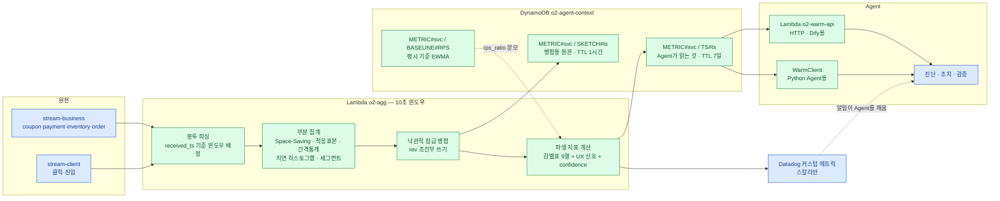

# Warm Path

Agent에게 판단 재료를 실시간으로 공급하는 계층입니다.
`docs/agent-data-requirements.md` §3·§7 에서 도출된 요구를 구현합니다.

```
warm/
├── src/o2warm/
│   ├── contract.py     o2events 계약 중 집계가 의존하는 값
│   ├── windows.py      10초 윈도우 · 봉투 해석
│   ├── sketch.py       병합 가능한 부분 집계
│   ├── metrics.py      감별 지표 계산
│   ├── confidence.py   데이터 신뢰도
│   ├── baseline.py     평시 기준 EWMA
│   ├── store.py        DynamoDB 병합 · 조회
│   ├── datadog.py      커스텀 메트릭 전송
│   └── client.py       Agent 조회 클라이언트
├── handlers/
│   ├── aggregate.py    Lambda o2-agg
│   └── serve.py        Lambda o2-warm-api
├── tests/              감별표 6개 + UX 저하 5개 시나리오 (정확한 건수는 `pytest -q`)
└── DEPLOY.md           배포 절차
```

Terraform 은 한 단계 위의 `warm-path.tf` 와 `lambda.tf`.

```bash
python -m venv .venv && .venv/Scripts/pip install -e ".[aws]" pytest
.venv/Scripts/pytest
```

계약 드리프트 검증(`tests/test_contract.py`)까지 돌리려면 `o2events` 가 필요합니다.
별도 저장소(`o2-sdk-for-event`)라 경로는 각자 체크아웃 위치에 맞춥니다.

```bash
.venv/Scripts/pip install -e <o2-sdk-for-event 체크아웃 경로>
```

---

## o2events SDK 와의 관계

**런타임 의존이 없습니다.** `from o2events.schemas import ...` 가 더 직접적으로
보이지만, `o2events/__init__.py` 가 emit·emitter·sinks 를 전부 끌어옵니다.
집계 Lambda 가 이벤트 **발행** 코드를 싣고 다니게 되고, 앱 SDK 버전이 오를
때마다 집계기도 재배포해야 합니다.

그래서 계약 값은 `contract.py` 에 두고, **드리프트는 시험이 잡습니다.**

```
런타임:  o2warm  ──✗──  o2events        ZIP 12개 파일 · 34KB
개발:    o2warm  ──✓──  o2events        tests/test_contract.py
```

`test_contract.py` 는 SDK 를 개발 의존성으로 불러와 이벤트 이름·enum·
payload 필드명이 실제 계약에 있는지 확인합니다. 앱 팀이 `pg_latency_ms` 를
바꾸면 배포 전에 깨집니다. 이것이 없으면 집계는 조용히 `null` 을 내고
Agent 는 "정상"으로 읽습니다. **틀린 값보다 나쁜 것이 조용히 빈 값입니다.**

---

## 1. Datadog 과의 경계 — 출처로 나눈다

이 프로젝트에서 가장 자주 다시 논쟁이 붙는 지점이라, 규칙을 먼저 못 박습니다.

> **데이터가 어떻게 수집되는가로 나눈다. 예외 없음.**
>
> | | Datadog | **Lambda (이 문서)** |
> |---|---|---|
> | 수집 주체 | Datadog Agent 가 EKS 에서 수집 | o2events SDK 가 Kinesis 로 명시 발행 |
> | 데이터 | 인프라 메트릭·로그·APM·Pod 상태 | 비즈니스·클라이언트 이벤트 |
> | 소유 | 인프라팀 | 데이터팀 |

### "Datadog 이 계산할 수 있느냐"로 나누지 않는 이유

그 기준으로 따지면 이 파이프라인이 내는 지표 12개 중 **7개는 Datadog 으로도
됩니다.** `failure_rate`, `failure_codes`, `cache_hit_rate`,
`pg_latency_ratio`, `version_fail_delta`, `rps_ratio`, `click_ratio` 는
로그 기반 메트릭과 태그·수식으로 산출 가능합니다.

그래서 능력을 기준으로 삼으면 지표마다 판단이 갈리고, 벤더가 기능을 하나
추가할 때마다 경계가 흔들립니다. **경계는 능력이 아니라 소유권으로 그어야
안정적입니다.**

능력 기준으로도 끝내 불가능한 것은 따로 있습니다. 상태를 들고 계산해야
하는 지표들입니다.

| 지표 | 왜 메트릭 시스템으로 안 되는가 |
|---|---|
| `interval_cv` | 사용자별 시각을 순서대로 들고 차분의 분산을 냄 |
| `top1pct_share` · `top5_share` | `user_key` 를 태그로 올려야 하는데 그것이 곧 카디널리티 폭발 |
| `distinct_users` · `ua_diversity` | 메트릭으로 고유 개수를 세는 것은 제약이 큼 |

여기에 더해 **메트릭이 아예 아닌 데이터**가 절반을 차지합니다 —
`POLICY#`, `TOPOLOGY#`, `CONTEXT#RUNDOWN`, `INCIDENT#SNAPSHOT`.
조치 Agent 의 Guardrail 전체가 여기 걸려 있고, 이것은 논쟁의 여지 없이
Datadog 의 일이 아닙니다.

### Datadog 은 비즈니스 지표의 '감지용 싱크'다

출처로 나눈다고 해서 Datadog 에 아무것도 안 보내는 것이 아닙니다.
**계산 주체와 전송 대상은 다른 층위입니다.**

```
계산:  Lambda 한 곳       ← 같은 값이 두 시스템에 생기지 않음
전송:  DynamoDB (판단용 상세)
       Datadog  (감지용 스칼라)
```

이래야 요구사항 문서 §2 의 "감지는 Datadog 하나로 일원화"와 충돌하지
않습니다. 보내는 것은 **고정 스칼라**(`metrics.DATADOG_SCALARS`)뿐이고,
`segments`·`segment_skew`·`failure_codes`·`top_contributors` 같은 맵·목록은
보내지 않습니다.

카디널리티가 **입력값이 아니라 고정된 열거값**으로 갈리는 지표는 예외로
태그 분해를 허용합니다 — `failure_rate`(event 종류), `event_rate`(event 종류),
`cache_hit_rate`·`latency_p95`(pod_name, 파드 수는 K8s가 정함)가 여기
해당하고 `datadog.py`의 `build_series()`에 있습니다. `user_key`·`campaign_id`
처럼 입력값이 카디널리티를 정하는 축은 절대 여기 넣지 않습니다.

**파드 축은 메트릭 이름을 새로 만들지 않습니다.** `latency_p95` 는 service
단위로 한 번, 파드마다 한 번씩 같은 이름으로 나갑니다 — 태그만 다릅니다
(D-054). 그래서 `avg:o2.warm.latency_p95{*} by {pod_name}` 을 치면 파드
시계열 외에 `pod_name:N/A` 가 하나 더 나옵니다. service 단위로 보낸 값이
태그가 없어서 그렇게 잡히는 것이고, 정상입니다.

파드별 지연은 **표본 5건 미만인 파드를 뺍니다**(`LATENCY_POD_MIN_SAMPLES`).
10초 윈도우에서 방금 뜬 파드는 요청을 한두 건만 받는데, 표본 한 건짜리
p95 를 outlier 탐지에 넣으면 **스케일아웃했다는 사실만으로** 이상치가
됩니다. 뺀 파드의 표본 수는 `latency_samples_by_pod` 에 남습니다(맵이라
Datadog 으로는 안 갑니다).

### 세 경로에서 Warm 이 맡는 것

| | Hot (Datadog) | **Warm (이 문서)** | Cold (S3) |
|---|---|---|---|
| 질문 | 지금 이상한가 | **왜 이상한가** | 어제 왜 그랬나 |
| 지연 | 1~2초 | **10~15초** | 5분 이상 |
| 형태 | 스칼라 시계열 | **파생 지표 + 분포 + 기여자** | 이벤트 원본 |
| 소비자 | Monitor·대시보드 | **진단·조치·검증 Agent** | Athena·재집계·평가 |
| 보존 | 15개월 | **7일** | 영구 |

### 이 경계가 감당하는 비용

`cache_hit_rate` 처럼 **Datadog 으로 훨씬 빨리 될 것을 직접 짜는 경우**가
생깁니다. 감수하는 이유는 한계 비용이 낮기 때문입니다 — 새 지표는
`sketch.py` 에 필드 하나 추가하는 수준입니다. 반면 경계가 흐릿한 비용은
지표가 늘 때마다 반복됩니다.

Agent 가 두 소스를 조회해야 하는 비용도 있지만, 이것은 이 경계의 고유
비용이 아닙니다. 어떻게 나누든 인프라 지표는 Datadog 에서 와야 합니다.

---

## 2. 흐름



Agent는 **알림을 받고 나서 당겨갑니다.** 상시 푸시 스트림을 만들지 않은
이유는 §7 에 있습니다.

---

## 3. 왜 '병합 가능한 부분 집계'인가

10초 윈도우를 만들려면 10초 치 이벤트가 한자리에 모여야 하는데,
Lambda는 그런 식으로 호출되지 않습니다. Kinesis 는 **배치**(batch —
한 번의 호출로 넘겨주는 레코드 묶음) 단위로 함수를 부르고, 그 경계는
윈도우 경계와 아무 관계가 없습니다.

```
배치 도착:  |--A--|-B-|---C---|--D--|
윈도우:     |------10초------|------10초------|
스트림:     business 와 client 가 각각 다른 호출로 도착
```

배치 하나로는 어떤 윈도우도 완성되지 않고, 같은 윈도우에 **최소 두 개의
호출**이 씁니다. 그래서 배치마다 부분 집계를 만들고 저장소에서 합칩니다.

병합이 성립하려면 모든 통계량이 결합법칙을 만족해야 합니다.

| 지표 | 그대로 들고 다니면 | 대신 보관하는 것 |
|---|---|---|
| 요청 간격 CV | 평균·표준편차 (병합 불가) | 건수·간격합·간격제곱합·양끝 시각 |
| 상위 기여자 | 전체 카운터 (400KB 초과) | Space-Saving 상위 256 |
| 고유 사용자 수 | 전체 집합 | 적응 표본 512 + 표본 비율 |
| PG 지연 중앙값 | 값 목록 (병합 불가) | 20 버킷 히스토그램 |
| **응답 지연 p95** | 값 목록 | **로그 버킷 히스토그램** (상대 오차 7%) |
| **세그먼트별 실패율** | 축×값 전량 | **축당 상위 48개 시도·실패 카운터** |

지연에 로그 버킷을 쓰는 이유는 상한이 없기 때문입니다. 87ms 든 8700ms 든
같은 **비율**의 오차를 갖는 것이 지연 분석에 맞습니다.

실측 크기입니다 — 이벤트 12,000건 · 고유 사용자 4,000 · 캠페인 30 기준.

```
스케치 JSON    30,163 B
gzip 저장분     8,417 B   ← DynamoDB 한도 400KB 의 2.1%
METRIC 아이템   3,562 B   ← Agent 가 읽는 것
```

**양끝 시각을 보관하는 이유**가 특히 중요합니다. 배치 경계에서 간격 하나가
끊기는데, 이어 붙이지 않으면 매크로의 규칙적인 간격이 배치 수만큼
사라져 `interval_cv` 가 실제보다 높게(=사람처럼) 나옵니다.
`test_sketch.py::test_merge_reconnects_interval_across_batches` 가 이것을 고정합니다.

### 잘렸다는 사실을 숨기지 않습니다

상한을 넘으면 잘라내되, 그 사실이 `confidence.completeness` 를 떨어뜨리고
`reasons` 에 문장으로 남습니다. 조용히 부정확해지는 것이 가장 나쁩니다.

- Space-Saving — 잘려도 **큰 것은 살아남습니다** (쫓겨난 카운트를 상속)
- 적응 표본추출 — 잘려도 **추정값이 편향되지 않습니다**
- 세그먼트 — **여기만 성질이 다릅니다.** 늦게 나타난 값을 통째로 버리므로
  그 구간의 저하는 아예 안 보입니다. 그래서 신뢰도 감점이 가장 크고,
  상한도 넉넉히(48) 잡았습니다

---

## 4. 동시성과 재시도

### 두 스트림이 같은 아이템에 씁니다

```
읽기(ConsistentRead) → 병합 → 조건부 쓰기(rev = 읽은 값)
                                    ↓ 조건 실패
                              다시 읽기부터
```

경쟁자는 샤드 수만큼입니다. 현재 스트림당 1샤드라 최대 2명이고,
재시도는 사실상 1회 안에 끝납니다.

`METRIC#` 쓰기는 `rev <= :rev` 조건이라 **순서가 뒤집혀도 최신 상태로
수렴**합니다. 두 아이템은 트랜잭션으로 묶지 않았습니다 — 스케치가 원본이고
METRIC 은 그 투영이라, METRIC 쓰기가 실패해도 다음 병합이 다시 씁니다.

### Kinesis 재시도가 이중 집계를 만들지 않습니다

DynamoDB 쓰기가 실패하면 예외를 던져 배치를 재처리시킵니다. 그런데 그
배치의 일부가 이미 반영됐다면 두 번 세어집니다.

그래서 부분 집계가 `(스트림:샤드) → 최대 sequence number` 를 함께 싣고,
병합 시 이미 반영된 구간이면 건너뜁니다. sequence number 는 샤드 안에서
단조 증가하므로 이 비교만으로 충분합니다.

**스트림 이름을 키에 넣는 것이 필수**입니다. 두 스트림 모두 샤드 ID가
`shardId-000000000000` 이라 샤드 ID만으로는 서로를 덮어씁니다.

---

## 5. 지표 정의 — 요구사항 문서와 다른 세 곳

구현하고 합성 데이터로 검증하는 과정에서 세 가지를 바꿨습니다.
근거는 `tests/test_scenarios.py` 에 시험으로 고정해 두었습니다.

### (1) `interval_cv` 를 요청 수로 가중합니다

요구사항 문서는 "user_key별 차분의 변동계수 **중앙값**"입니다.
그대로 구현하니 감별표와 **반대 방향**이 나왔습니다.

```
계정당 1표 (문서 정의):   매크로 1.14  >  정상 폭증 1.08   ← 감별 실패
요청 수로 가중:           매크로 0.02  <  정상 폭증 1.08   ← 감별 성공
```

원인은 명확합니다. 매크로는 **요청의 다수**를 차지하지만 **계정 수로는
소수**입니다(시험 데이터에서 126명 중 6명). 계정마다 한 표를 주면
중앙값은 언제나 배경의 정상 사용자를 가리킵니다.

`interval_cv` 를 요청 가중 중앙값으로 두고, 문서 정의값은
`interval_cv_unweighted` 로 함께 냅니다. 상위 기여 계정만 본
`interval_cv_top` 도 같이 실어 Agent가 근거를 좁힐 수 있게 했습니다.

### (2) `top5_share` 를 추가했습니다

`top1pct_share` 는 사용자가 100명대일 때 상위 구간이 1~2개밖에 안 되어
매크로 무리를 놓칩니다. 고정 개수 쪽이 그 구간에서 훨씬 또렷합니다.

```
              top1pct_share    top5_share
정상 폭증          0.052          0.021
매크로             0.263          0.658     ← 31배 차이
```

문서 정의값도 그대로 냅니다. 규모가 커지면 `top1pct_share` 가 더 안정적이라
둘 다 필요합니다.

### (3) `ip_diversity` 를 더했습니다

`ua_diversity` 는 `ua_key` 를 실은 클라이언트 이벤트에서만 나옵니다.
그런데 **매크로는 클라이언트 이벤트를 아예 안 보냅니다.** 계약을 바꾸지
않고 쓸 수 있는 서버 측 대체 신호로 `client_ip_key` 기반 다양성을 넣었습니다.

---

## 6. 검증된 시나리오

### 6-1. 감별표 — "장애가 났을 때 원인을 가릴 수 있는가"

합성 이벤트로 6개 시나리오를 재현해 실측한 값입니다.

| 시나리오 | rps_ratio | top5_share | interval_cv | click_ratio | cache_hit | pg_ratio | ver_delta |
|---|---|---|---|---|---|---|---|
| 트래픽 폭증 | 6.00 | 0.021 | 1.080 | 1.00 | — | — | — |
| **매크로** | 3.40 | **0.658** | **0.024** | **0.118** | — | — | — |
| 캐시 미스 폭주 | 2.00 | 0.025 | 0.960 | 1.00 | **0.05** | — | — |
| PG 장애 | 0.67 | 0.025 | — | — | — | **0.958** | — |
| DB 장애 | 0.67 | 0.025 | — | — | — | **0.042** | — |
| 배포 장애 | 0.67 | 0.025 | — | — | — | 0.275 | **0.600** |

읽는 법이 설계의 요지입니다.

- **트래픽 폭증 vs 매크로** — rps 는 둘 다 오릅니다. 집중도(0.021 vs 0.658),
  규칙성(1.08 vs 0.02), 클릭 비율(1.00 vs 0.12) 세 축이 갈라냅니다.
- **PG 장애 vs DB 장애** — 결제 실패율이 **완전히 같습니다**(둘 다 0.60).
  실패 사유 코드와 `pg_latency_ratio` 만이 구분합니다.
- **배포 장애** — 전체 실패율 0.30 은 그 자체로 결론이 안 납니다.
  버전별 실패율 격차가 유일한 근거입니다.

`test_no_single_metric_separates_all_scenarios` 가 **어느 지표 하나도 6개를
전부 구분하지 못한다**는 것을, 그리고 **조합하면 6개가 전부 다른 지문을
갖는다**는 것을 동시에 고정합니다. 앞의 절반이 Agent가 필요한 이유이고,
뒤의 절반이 Agent가 판단할 수 있는 근거입니다.

### 6-2. 사용자 경험 저하 — "장애가 안 났는데 사용자가 불편한가"

감별표가 "원인을 가릴 수 있는가"를 본다면, 이쪽은 **애초에 알아채는가**를
봅니다. 공통 전제는 하나입니다.

> 응답은 200. 에러율 정상. p95 임계 안. 그런데 체감은 나쁩니다.

이 유형은 인프라 관측이 **원리적으로** 못 봅니다. 서버가 오동작한 게
아니기 때문입니다. 실측값입니다(`tests/test_ux.py`).

| 시나리오 | 실패율 | p50 | p95 | 재시도 | 폴백 | 취소 | 잡아내는 신호 |
|---|---|---|---|---|---|---|---|
| 정상 (대조군) | 0.000 | 76 | 116 | 0.00 | 0.00 | — | — |
| **캠페인 한정 실패** | **0.136** | 88 | 88 | 0.00 | — | — | `segment_skew` |
| **재시도 폭증** | 0.000 | 88 | 88 | **0.60** | — | — | `retry_rate` |
| **취소 급증** | — | 153 | 153 | — | — | **0.35** | `cancel_rate` |
| **폴백 저하** | — | 469 | 469 | — | **0.80** | — | `fallback_rate` |
| **꼬리 지연** | 0.000 | 88 | **3315** | 0.00 | — | — | `latency_p95` |

읽는 법이 요지입니다.

- **캠페인 한정 실패** — 전체 실패율 `0.136` 은 흔한 임계(20~30%)에 안
  걸립니다. 세그먼트를 나눠야 캠페인 하나가 `0.95` 인 것이 보입니다.
  **평균이 가리는 전형입니다.**
- **취소 급증 · 폴백 저하** — 실패율이 `—` 입니다. 값이 낮은 게 아니라
  **실패라는 개념 자체가 없습니다.** `inventory.check` 에는 `result`
  필드가 없고, 취소는 요청이 끝난 뒤 비동기로 일어납니다.
- **꼬리 지연** — p50 은 대조군과 사실상 같은데 p95 만 28배입니다.
  평균·중앙값 기반 임계로는 절대 안 걸립니다.
- **재시도 폭증** — 서버는 매번 성공했습니다. 사용자가 같은 동작을
  반복했다는 사실만이 체감이 나빴다는 증거입니다.

`test_each_scenario_is_caught_by_a_different_signal` 이 **유형마다 다른
신호가 반응한다**는 것을, `test_no_ux_signal_fires_on_healthy_traffic` 이
**정상 트래픽에서는 전부 조용하다**는 것을 고정합니다. 뒤쪽이 없으면
신호가 늘 울려서 아무도 안 봅니다.

### 세그먼트 편차 — 맵이 아니라 순위를 냅니다

축별 맵을 통째로 넘기면 Agent 가 볼 것이 축 수만큼 늘어납니다.
그래서 벗어난 것만 골라 순위를 매깁니다.

```jsonc
"segment_skew": [{
  "axis": "campaign_id", "value": "LIVE-FLASH-02",
  "failure_rate": 0.95, "overall_failure_rate": 0.136,
  "lift": 7.0, "n": 100, "failed": 95,
  "excess_failures": 81            // ← 이 값으로 순위를 매깁니다
}]
```

**순위 기준이 비율이 아니라 초과 실패 건수입니다.** 비율이 아무리 튀어도
표본이 5건이면 조치할 근거가 못 됩니다(`segment_min_samples`, 기본 20).

### 계약 한계 — 기기별 감별은 불가능합니다

`device_type` 은 **클라이언트 이벤트에만** 실립니다. 비즈니스 이벤트에는
없습니다. 따라서 "모바일 사용자만 결제가 실패한다"는 현재 계약으로
감지할 수 없고, 클릭 볼륨의 기기별 급감까지만 보입니다.

서버 이벤트에 `device_type` 을 추가하려면 계약 변경이 필요합니다.
`test_device_segmentation_is_client_only` 가 이 한계를 시험으로 고정해
두었으니, 계약이 바뀌면 그 시험이 먼저 깨집니다.

---

## 7. Agent에게 어떻게 전달하는가

### 푸시가 아니라 풀입니다

감지는 이미 Datadog Monitor 가 합니다. Agent는 알림을 받고 깨어난 뒤
그 시점의 재료를 당겨갑니다. 상시 푸시 스트림을 만들면 아무도 읽지 않는
초당 수십 건을 흘려보내면서 Agent 쪽에 상태 관리를 떠넘기게 됩니다.

10초 윈도우 + 병합 지연을 합쳐 **알림에서 조회까지 10~15초**면 판단 재료가
준비됩니다. 장애 대응 루프에서 이 정도는 충분합니다.

### 한 번의 호출로 전부 줍니다

```python
from o2warm.client import WarmClient

bundle = WarmClient().snapshot("coupon-api", broadcast_id="LIVE-20260813-01")
```

```jsonc
{
  "service": "coupon-api",
  "as_of": "2026-08-13T11:20:34.120Z",
  "windows": [ /* 최근 6개 윈도우, 오래된 것부터 */ ],
  "latest":  { /* 가장 최근 윈도우 전체 지표 */ },
  "trend":   { "rps_ratio": {"from": 1.1, "to": 3.4, "change": 2.3} },
  "deploy":  { "version": "v1.5.0", "previous_version": "v1.4.2" },
  "rundown": { /* 방송 큐시트 */ },
  "policy":  { /* 허용 액션·파라미터 범위·자율성 등급 */ },
  "topology":{ /* 의존 서비스·공유 리소스 */ },
  "gaps":    ["방송 큐시트 없음 — 예정된 급증을 이상으로 오탐할 수 있음"]
}
```

Agent가 지표·큐시트·배포이력·정책을 각각 조회하게 만들면, 호출마다 시점이
어긋나 **서로 다른 순간의 재료로 하나의 결론을 내리게 됩니다.** 그리고 그
조회 순서를 Agent 팀이 구현해야 합니다.

`gaps` 는 **빠진 재료를 문장으로 알려줍니다.** Agent가 없는 데이터를
'정상'으로 읽는 것이 가장 위험합니다.

### 실행 환경에 따라 두 갈래

| 환경 | 경로 | 이유 |
|---|---|---|
| Python Agent | `WarmClient` 직접 | HTTP 홉이 없어 빠릅니다 |
| Dify 등 | `o2-warm-api` Function URL | HTTP 밖에 안 되는 환경 |

HTTP 핸들러는 `WarmClient` 를 **얇게 감싸기만 합니다.** 로직이 두 곳에
나뉘면 SDK로 본 값과 HTTP로 본 값이 달라집니다.

### 스냅샷 세 시점

```python
client.record_snapshot("INC-20260813-001", "DETECT", "coupon-api",
                       broadcast_id="LIVE-20260813-01")             # 감지 직후
# ... 진단, 승인 요청, 승인 대기 ...
client.record_snapshot("INC-20260813-001", "PRE",  "coupon-api")    # 조치 직전
# ... 조치 실행, 안정화 60초 ...
client.record_snapshot("INC-20260813-001", "POST", "coupon-api")
diff = client.compare_snapshots("INC-20260813-001")                 # PRE vs POST
```

**DETECT 와 PRE 는 용도가 다른 기록입니다.**

| phase | 용도 | 무엇을 남기나 |
|---|---|---|
| `DETECT` | 그때 Agent 가 본 것 — 사후 재현·`ground_truth` 라벨링 | 번들 전체 |
| `PRE` | 조치 효과의 기준선 | 지표만 |
| `POST` | 조치 후 상태 | 지표만 |

PRE 를 감지 시점에 찍으면 **진단과 승인 대기 동안의 자기악화분이 조치 효과에
섞입니다.** 커넥션 쏠림처럼 스스로 악화되는 장애에서 이 오염이 큽니다.
그래서 PRE 는 실행 직전이어야 합니다.

거꾸로 감지 시점 기록을 PRE 로 대신할 수도 없습니다. 지표 시계열은 TTL 7일이라
사후 조회되지만 `confidence`·`gaps`·`rundown`·`policy` 는 **조회 시점 기준으로
다시 계산**되므로, 그때 값은 그때 남기지 않으면 사라집니다. 오판을 되짚을 때
필요한 것이 정확히 그 값들입니다.

`compare_snapshots` 는 **PRE 와 POST 만** 봅니다. DETECT 를 비교에 끼우면
대기 중 악화분까지 조치 성과로 잡힙니다.

PRE·POST 가 한쪽이라도 없으면 API는 **409** 를 냅니다. 빈 값을 조용히
돌려주면 복구되지 않은 상태를 복구로 판정합니다. DETECT 만 있는 것은
복구 판정에 아무 도움이 되지 않으므로 409 그대로입니다.

비교 대상에 비즈니스 지표가 포함되는 것이 핵심입니다. 인프라 지표만 보면
캐시 미스나 재고 정합성 문제처럼 **p95 와 에러율은 정상인데 취소율만 오르는
Silent Failure** 를 복구로 오판합니다.

### 인프라 지표는 Agent 가 채웁니다 — 계약

§1 의 경계에서 직접 따라 나오는 규칙입니다. **인시던트 레코드만은 두 출처를
합쳐야 완결됩니다.**

```jsonc
POST /v1/warm/incidents/INC-20260813-001/snapshot
{
  "phase": "PRE",
  "service": "coupon-api",
  "extra": {                       // ← Agent 가 Datadog 에서 조회해 첨부
    "p95_ms": 820,
    "error_rate": 0.04,
    "cpu_pct": 71
  }
}
```

| 항목 | 누가 채우는가 | 왜 |
|---|---|---|
| 비즈니스 파생 지표 | **이 API 가 자동으로** | 우리가 안 남기면 사라짐. TTL 7일 |
| 인프라 지표 (`extra`) | **Agent 가 첨부** | Datadog 이 시계열로 보관하므로 사후 조회는 가능하지만, 인시던트 레코드는 그 자체로 완결되어야 재현·평가가 됨 |

**이 계약을 문서에만 두고 넘어가면 Agent 팀은 Lambda 가 채워줄 것으로
기대합니다.** 그러면 인시던트 레코드에 절반만 남고, `ground_truth` 라벨링을
붙여도 "그 시점 Agent 가 본 것"을 재구성할 수 없습니다.

`extra` 가 비어 있어도 API 는 통과시킵니다 — 조치 직전의 기록을 인증 실패로
막는 것이 더 위험하기 때문입니다. 대신 누락은 인시던트 레코드 품질 문제로
남습니다.

---

## 8. 신뢰도

```jsonc
"confidence": {
  "score": 0.75,
  "freshness": 1.0,
  "completeness": 0.75,
  "reasons": ["평시 기준 미확보 — rps_ratio 미산출"]
}
```

- **freshness** — 조회할 때마다 다시 계산합니다. 저장된 값은 '쓸 때'
  기준이라 40초 뒤에 읽으면 거짓말이 됩니다.
- **completeness** — 스트림 누락, 부분 집계 잘림, 평시 기준 부재.
- **score** — 두 값의 최솟값. 곱하면 각각은 멀쩡한데 합쳐서 낮아져
  사유 설명과 어긋납니다.

계산할 수 없는 지표는 0이 아니라 **null** 입니다. 표본이 없어서 0인 것과
실제로 0인 것을 Agent가 구분할 수 있어야 합니다.

---

## 9. 남아 있는 것

| 항목 | 막고 있는 것 | 이 파이프라인과의 관계 |
|---|---|---|
| 방송 큐시트 적재 | 예정된 급증의 오탐 | `CONTEXT#RUNDOWN` 을 읽는 코드는 완성. 넣는 경로만 필요 |
| 배포 이력 (ArgoCD webhook) | 배포 장애 감별 정확도 | 없어도 버전 문자열 순서로 대체 동작 |
| 정책·토폴로지 수동 작성 | 조치 Agent Guardrail | 읽는 코드는 완성. **팀 합의 문서에 가까운 작업** |
| 인시던트 레코드 S3 기록 | 평가·KB 재구축 | 스냅샷은 DynamoDB에 남음. S3 이관 경로 미구현 |
| 벡터 KB | Runbook·과거 사례 | Warm Path 밖 |
| **이벤트 부재의 신호 승격** | 프론트 고장 감지 | **아래 참고** |
| **서버 이벤트의 `device_type`** | 기기별 저하 감별 | 계약 변경 필요 (§6-2) |
| 클라이언트 에러·렌더 지연 | 브라우저 측 저하 | 계약에 이벤트 없음. Datadog RUM 영역 |

앞의 세 개는 **읽는 쪽이 이미 다 만들어져 있습니다.** 아이템만 넣으면
`snapshot()` 응답에 바로 실리고, `gaps` 에서 해당 문장이 사라집니다.

### 이벤트 부재를 신호로 승격하기

지금은 이벤트가 0이면 윈도우 아이템이 아예 안 생기고 `gaps` 에
"이벤트가 들어오지 않았습니다"로만 남습니다. 그래서 **"파이프라인이
고장 났다"와 "사용자가 아무도 성공하지 못했다"가 구분되지 않습니다.**

후자는 최악의 사용자 경험 저하인데 데이터 품질 문제로 취급됩니다.
고치려면 서비스별 기대 볼륨을 알아야 하고, 그 정보는 이미
`BASELINE#RPS` 가 들고 있습니다. 필드 추가로는 안 되고 별도 설계가
필요해 남겨 두었습니다.

### 경계 규칙의 미처리 사례

§1 의 "출처로 나눈다" 규칙은 EKS 수집과 Kinesis 발행 두 가지만 다룹니다.
**브라우저에서 직접 수집되는 데이터(Datadog RUM)는 어느 쪽도 아닙니다.**
RUM 을 도입한다면 규칙에 한 줄이 추가되어야 합니다.
